# 乌东文旅「衣食住行」综合服务平台 · 软件设计文档

| 项目 | 内容 |
|---|---|
| 文档版本 | V6.3 |
| 编制日期 | 2026-09-08 |
| 项目名称 | 乌东文旅「衣食住行」综合服务平台 |
| 编写人 | 开发组全体（6 人） |
| 适用人员 | 后端 / 前端 / 测试 |
| 开发模式 | 每组独立开发一个完整平台，组内 6 人混合分工 |
| 架构形态 | 模块化单体（Modular Monolith） |

## 修改记录

| 版本 | 日期 | 修改人 | 修改内容 |
|---|---|---|---|
| V1.0 | 2026-09-08 | — | 初始版本（架构 + 数据库 + API 清单） |
| V2.0 | 2026-09-08 | — | 按五部分结构重组（架构/技术栈/目录/数据库/API） |
| V3.0 | 2026-09-08 | — | 补充需求分析、详细设计、界面、测试、部署九章结构 |
| V4.0 | 2026-09-08 | — | 补充数据库原则/范式/ER图、代码级类设计、用例规约、接口详细定义 |
| V5.0 | 2026-09-08 | — | 统一接口格式（参数名/类型/是否必须/示例/备注）、补充异常与坑点、枚举值、并发/事务说明 |
| V6.0 | 2026-09-08 | — | 对标整合版评审补齐：① 5.8.2 缓存策略由 4 条扩至 9 条（库存原子键/首页聚合/详情页/RBAC 权限码/未读消息数，含 key 规范）；② 5.8.4 并发防护升级为 Redis Lua 原子扣减 + MySQL 条件更新双保险，补 Redis 与 DB 一致性补偿规则；③ 新增 5.8.5 性能指标实现手段（四项指标逐条落地 + autocannon 压测验收口径）；④ 9.3 部署步骤改为 Docker Compose 一键部署（推荐，含完整 yml 编排，对应 ADR-9），原 PM2+Nginx 步骤降为方式二备选；⑤ 5.1.3 状态图补审批驳回回退路径（REFUND_PENDING→PAID）；⑥ 修正 10.3 中旧版 5 态状态机描述为 8 态 |
| V6.1 | 2026-09-08 | — | 二轮评审残留项修复：⑴ 新增 travel_route_calendar 路线按出发日期库存表（此前路线无任何库存承载），Redis 键 route:{routeId}:{date} 并入 5.8.2；⑵ base_order_item.entity_type 补 product_sku 对齐购物车枚举，修复农产品映射断裂，下单接口 entityType 补枚举清单；⑶ 1.5 参考资料的需求规格 V1.0 更正为 V2.0（基线版本）；⑷ 4.5 数据字典措辞修正（速查定位，全量字段以 4.4 为准，对应 ADR-7）；⑸ 5.8.3 超时关单明确复用 cancel()（含回补库存、幂等）；⑹ 内容审核补图片/视频机审方案（LocalImageMock + 人工队列兜底 + 预留腾讯云 CMS Provider），禁言规则落 mute_until |
| V6.2 | 2026-09-08 | — | 取价逻辑全文统一（ADR-5 为唯一计价口径）：⑴ 5.1 OrderService.create 伪代码明确「服务端按 entityId 取价重算 totalAmount/payAmount 并落库，客户端提交金额仅作比对校验，不一致抛 2003」；⑵ 5.1.2 下单时序图补权威取价步骤（原时序图缺取价环节）；⑶ 7.3.3 下单接口参数表为 items[].price / totalAmount / payAmount 补「仅用于比对校验，服务端重算」语义标注；⑷ 4.4 base_order_item.price 字段注明为服务端价快照 |
| V6.3 | 2026-09-08 | — | 3.1 系统总体架构图改为五层框图格式（客户端层→API 网关层→六模块服务层→公共服务层→数据层，等宽字符绘制、纯文本可打印），替换原 mermaid flowchart；图注补模块间协作边界与 ADR-2 本地硬盘存储说明；修正文档头版本号滞后（V6.1→与修改记录同步） |

---

## 目录

[TOC]

---

# 第 1 章 引言

## 1.1 编写目的

本文档是乌东文旅「衣食住行」综合服务平台的**软件设计说明书**，用于指导 6 人开发小组将一个完整平台从需求落地为可编码、可测试、可部署的实现。文档定义了系统的架构、模块划分、数据库模型、接口契约、详细类设计、界面设计与测试方案，作为开发与验收的共同依据。

阅读对象：开发组成员、项目指导老师、评审小组。

## 1.2 项目背景

乌东村是贵州黔东南苗族侗族自治州特色苗寨，拥有苗族银饰锻造、蜡染刺绣、苗家长桌宴、特色民宿、苗寨梯田与节庆文化等文旅资源。现有运营以线下为主，缺乏统一的线上服务入口。本平台以「衣食住行」为业务主线，覆盖游客从内容种草、社区分享、商品/餐饮/住宿/门票预订到订单管理、平台运营的全链路。

## 1.3 术语定义

| 术语 | 说明 |
|---|---|
| OPC | One Person Company，一人公司模式 |
| SKU | Stock Keeping Unit，商品库存单位 |
| 电子票 | 线上购买后生成的可核销凭证，含二维码 |
| UGC | User Generated Content，用户生成内容 |
| GMV | Gross Merchandise Volume，成交总额 |
| DAU/MAU | 日活跃用户数 / 月活跃用户数 |
| RBAC | Role-Based Access Control，基于角色的访问控制 |
| RAG | Retrieval-Augmented Generation，检索增强生成 |
| JWT | JSON Web Token，令牌鉴权 |
| ORM | Object Relational Mapping，对象关系映射 |
| 房态日历 | 按日期展示房间可订情况与价格的日历 |

## 1.4 文档范围

本文档覆盖平台的**全部 7 个模块**（1 个公共底座 + 6 个业务模块）与三端（微信小程序、PC 网页端、管理后台）。范围包括：需求分析、总体架构、数据库设计、详细类设计、界面设计、接口设计、测试设计与部署设计。

## 1.5 参考资料

- 《乌东文旅「衣食住行」综合服务平台 需求规格说明书 V2.0》（2026-09-08，基线版本）
- 《技术栈选型文档》
- Midway.js 官方文档（https://midwayjs.org/）
- cool-js（cool-admin）官方文档（https://cool-js.com/）

---

# 第 2 章 需求分析

## 2.1 功能需求

### 2.1.1 系统参与者

| 参与者 | 说明 |
|---|---|
| 游客（注册用户） | 浏览、搜索、下单、预订、上传照片、发布游记、互动 |
| 商家 | 名下拥有商品/房源/餐位/线路，运营自家店铺 |
| 平台管理员 | 平台运营方人员，全局管理 |

### 2.1.2 系统用例总览

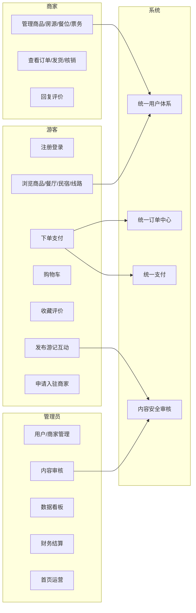

### 2.1.3 各模块用例描述

#### 模块一：衣（非遗商品）

| 用例 | 参与者 | 前置条件 | 主流程 | 后置条件 |
|---|---|---|---|---|
| 浏览商品 | 游客 | — | 进入分类→选分类→看列表→点详情 | 展示商品详情 |
| 搜索商品 | 游客 | — | 输关键词→返回结果 | 展示匹配商品 |
| 加入购物车 | 游客 | 已登录、商品有库存 | 选 SKU→加购 | 购物车新增项 |
| 立即购买 | 游客 | 已登录、有库存 | 选 SKU→下单→支付 | 生成订单 |
| 收藏商品 | 游客 | 已登录 | 点收藏/取消 | 收藏状态切换 |
| 评价商品 | 游客 | 订单已完成 | 评分+文字+图片→提交 | 生成评价 |
| 管理商品 | 商家 | 商家权限 | 增删改商品/SKU/库存 | 商品库更新 |

#### 模块二：食（餐饮预订 + 农产品）

| 用例 | 参与者 | 前置条件 | 主流程 | 后置条件 |
|---|---|---|---|---|
| 浏览餐厅 | 游客 | — | 列表/地图→详情 | 展示餐厅+菜品+时段 |
| 餐位预订 | 游客 | 已登录、提前≥2h | 选日期→时段→人数→填信息→支付 | 生成餐位订单 |
| 取消预订 | 游客 | 已预订 | 取消（政策判断） | 订单取消 |
| 购买农产品 | 游客 | 已登录 | 加购→结算→支付 | 生成商品订单 |
| 商家管理餐厅 | 商家 | 商家权限 | 维护餐厅/菜品/时段 | 更新 |

#### 模块三：住（民宿预订）

| 用例 | 参与者 | 前置条件 | 主流程 | 后置条件 |
|---|---|---|---|---|
| 搜索民宿 | 游客 | — | 入住/离店/人数→筛选 | 展示民宿列表 |
| 查看房态 | 游客 | — | 选房型→看日历 | 展示可订日期 |
| 预订民宿 | 游客 | 已登录、有房 | 选房型→日期→填入住人→预付 | 生成住宿订单 |
| 取消/退款 | 游客 | 已预订 | 按政策取消/退款 | 订单状态更新 |
| 评价民宿 | 游客 | 已离店 | 评分+文字+图片 | 生成评价 |

#### 模块四：行（门票 + 路线）

| 用例 | 参与者 | 前置条件 | 主流程 | 后置条件 |
|---|---|---|---|---|
| 购买门票 | 游客 | 已登录 | 选票种→日期→数量→游客信息→支付 | 生成电子票 |
| 购买路线 | 游客 | 已登录、提前≥1天 | 选路线→日期→人数→支付 | 生成电子票 |
| 查看电子票 | 游客 | 已购 | 看二维码 | 展示电子票 |
| 退票 | 游客 | 未使用 | 退票（24h 判断） | 订单退款 |
| 核销电子票 | 商家 | 商家权限 | 扫码/手输→核销 | 电子票置已用 |

#### 模块五：社区（照片分享）

| 用例 | 参与者 | 前置条件 | 主流程 | 后置条件 |
|---|---|---|---|---|
| 发布游记 | 游客 | 已登录 | 上传图/视频→写文字→加话题→发布→审核 | 游记发布 |
| 浏览信息流 | 游客 | — | 推荐/最新排序浏览 | 展示内容 |
| 点赞评论 | 游客 | 已登录 | 点赞/评论/二级回复 | 互动计数更新 |
| 关注用户 | 游客 | 已登录 | 关注/取关 | 关注关系更新 |
| 举报内容 | 游客 | 已登录 | 填原因举报 | 生成举报 |
| 内容审核 | 管理员 | 管理员权限 | 通过/拒绝 | 内容状态更新 |

#### 模块六：管理后台

| 用例 | 参与者 | 前置条件 | 主流程 | 后置条件 |
|---|---|---|---|---|
| 商家入驻审核 | 管理员 | 管理员权限 | 查资质→通过/驳回 | 商家开通 |
| 用户管理 | 管理员 | 管理员权限 | 查用户→封禁/解封 | 用户状态更新 |
| 数据看板 | 管理员 | 管理员权限 | 查各类指标 | 展示数据 |
| 首页运营 | 管理员 | 管理员权限 | 配置轮播/推荐/公告 | 首页更新 |
| 财务结算 | 管理员 | 管理员权限 | 生成结算单→结算 | 财务记录更新 |
| 全局订单查询 | 管理员 | 管理员权限 | 跨模块查订单 | 展示订单 |

### 2.1.4 关键用例规约

#### UC-01 下单

| 项 | 内容 |
|---|---|
| 用例名称 | 下单 |
| 参与者 | 游客 |
| 前置条件 | 已登录、商品有库存 |
| 主流程 | 1. 选择 SKU（立即购买）或勾选购物车（结算）→ 2. 提交订单 → 3. 系统生成 PENDING 订单 → 4. 扣减库存 → 5. 跳转支付 |
| 备选流程 | 2a. 购物车结算：勾选多项 → 合并生成订单 |
| 异常流程 | 3a. 库存不足 → 提示「库存不足」并终止；4a. 金额校验失败 → 返回 2003 |
| 业务规则 | 库存为 0 不可下单；金额需与明细一致 |
| 后置条件 | 生成 PENDING 状态订单 |

#### UC-02 支付

| 项 | 内容 |
|---|---|
| 用例名称 | 支付 |
| 参与者 | 游客 |
| 前置条件 | 存在 PENDING 订单 |
| 主流程 | 1. 发起支付 → 2. mock 支付成功 → 3. 订单状态 PENDING→PAID → 4. 写支付记录 |
| 异常流程 | 2a. 订单状态非 PENDING → 返回 2002 |
| 业务规则 | 仅待支付订单可支付 |
| 后置条件 | 订单 PAID，生成支付记录 |

#### UC-03 餐位预订

| 项 | 内容 |
|---|---|
| 用例名称 | 餐位预订 |
| 参与者 | 游客 |
| 前置条件 | 已登录、提前 ≥2 小时 |
| 主流程 | 1. 选餐厅 → 2. 选日期/时段/人数 → 3. 填姓名电话 → 4. 提交预订 → 5. 生成 food_seat 订单 |
| 异常流程 | 4a. 提前 <2h → 拒绝；4b. 时段已满 → 提示换时段 |
| 业务规则 | 提前 ≥2h；取消 24h 前免费、24h 内扣 50% |
| 后置条件 | 生成餐位预订订单 |

#### UC-04 民宿预订

| 项 | 内容 |
|---|---|
| 用例名称 | 民宿预订 |
| 参与者 | 游客 |
| 前置条件 | 已登录、目标日期有房 |
| 主流程 | 1. 搜索（入住/离店/人数）→ 2. 选房型 → 3. 房态日历选日期 → 4. 填入住人（含身份证）→ 5. 预付 → 6. 生成 hotel 订单 |
| 异常流程 | 4a. 房态库存不足 → 拒绝；5a. 支付失败 → 订单取消 |
| 业务规则 | 预付房费；取消 3 天前免费、1-3 天扣 30%、当天不可退 |
| 后置条件 | 生成住宿订单，房态扣减 |

#### UC-05 发布游记

| 项 | 内容 |
|---|---|
| 用例名称 | 发布游记 |
| 参与者 | 游客 |
| 前置条件 | 已登录、当日发布 <10 篇 |
| 主流程 | 1. 上传图片(≤9)/视频(≤60s) → 2. 写文字(≤5000) → 3. 加话题/关联地点 → 4. 发布 → 5. 内容安全审核 |
| 异常流程 | 4a. 敏感词命中 → 进入 PENDING 待人工复审 |
| 业务规则 | 文字 ≤5000、图片 ≤9、视频 ≤60s；日发 ≤10；敏感词 3 次禁言 24h |
| 后置条件 | 游记发布（NORMAL 或 PENDING） |

## 2.2 非功能需求

### 2.2.1 性能需求

| 指标 | 要求 |
|---|---|
| 首页加载时间 | ≤ 2 秒（4G 网络） |
| API 响应时间 | 95% 请求 ≤ 500ms |
| 并发用户数 | 支持 1000 并发用户 |
| 图片加载 | 缩略图 ≤ 200KB，原图懒加载 |
| 搜索响应 | ≤ 1 秒返回结果 |

### 2.2.2 安全需求

- 密码 bcrypt 加密存储。
- 敏感信息（身份证、手机号）脱敏展示。
- API 接口使用 HTTPS。
- 防 SQL 注入（TypeORM 参数化查询）。
- 防 XSS 攻击（富文本过滤）。
- 防 CSRF 攻击。
- 操作日志全记录。
- 关键操作（支付、退款）二次验证。

### 2.2.3 可用性

- 系统可用性 ≥ 99.5%。
- 关键服务故障恢复时间 ≤ 30 分钟。
- 数据每日凌晨自动备份，保留 30 天。

### 2.2.4 兼容性

| 端 | 兼容范围 |
|---|---|
| 小程序 | 微信 8.0+ |
| PC 端 | Chrome 90+、Edge 90+、Safari 14+ |
| 管理后台 | Chrome 90+、Edge 90+ |
| 屏幕适配 | 移动端 375px-414px；PC 端 1280px+ |

---

# 第 3 章 总体设计

## 3.1 系统总体架构

系统采用**模块化单体**架构：一个后端应用（Midway.js + cool-js 脚手架）+ 三个前端（小程序 uni-app / PC Vue3 / 管理后台 Vue3），后端按模块划分目录、共享公共底座。

```
┌─────────────────────────────────────────────────────────────────────────────────────────┐
│ 客户端层：小程序端（uni-app）  PC 网页端（Vue3）  管理后台（Vue3）                      │
└─────────────────────────────────────────────────────────────────────────────────────────┘
                                             │ HTTPS / JSON（REST + JWT）
                                             ▼
┌─────────────────────────────────────────────────────────────────────────────────────────┐
│ API 网关层（统一鉴权 / 限流 / 日志 / 异常处理）                                         │
└─────────────────────────────────────────────────────────────────────────────────────────┘
                                             │
                                             │
┌──────────────┬──────────────┬──────────────┼──────────────┬──────────────┬──────────────┐
│模块一服务    │模块二服务    │模块三服务    │模块四服务    │模块五服务    │模块六服务    │
│衣-非遗商品   │食-餐饮特产   │住-民宿预订   │行-门票路线   │社区-游记相册 │平台管理      │
└───────┬──────┴───────┬──────┴───────┬──────┴───────┬──────┴───────┬──────┴───────┬──────┘
        │              │              │              │              │              │
        ▼              ▼              ▼              ▼              ▼              ▼
┌─────────────────────────────────────────────────────────────────────────────────────────┐
│ 公共服务层（base）：用户 / 认证 / 订单 / 支付 / 上传 / 消息 / 搜索                      │
└─────────────────────────────────────────────────────────────────────────────────────────┘
                                             │
                                             ▼
┌─────────────────────────────────────────────────────────────────────────────────────────┐
│ 数据层：MySQL（单库） /  Redis（缓存） /  本地硬盘（对象存储）                          │
└─────────────────────────────────────────────────────────────────────────────────────────┘
```

> 图注：模块化单体，六个业务模块按目录划分、共享同一进程与底座；业务模块间不直接互访，跨模块协作一律经公共服务层（base）；对象存储因成本选用本地硬盘（ADR-2），与需求文档「OSS」的差异已在决策记录中诚实标注。

## 3.2 模块划分

| 模块目录 | 业务域 | 职责 | 依赖 |
|---|---|---|---|
| `base` | 公共底座 | 用户/认证、统一订单、购物车、支付、上传、消息、搜索 | 无（最底层） |
| `goods` | 衣 | 非遗商品电商 | base |
| `food` | 食 | 餐饮预订 + 农产品特产 | base |
| `hotel` | 住 | 民宿预订 | base |
| `travel` | 行 | 门票 + 路线订票 | base |
| `community` | 社区 | 游记 UGC 内容社区 | base |
| `admin` | 管理后台框架 | RBAC/菜单/商家审核/看板/运营/财务/全局订单 | base + 各模块 |

**边界铁律**：业务模块之间不直接访问对方的表，跨模块协作一律走 `base` 的 Service（订单、用户、支付、上传、消息）。

## 3.3 技术选型

| 层 | 技术 | 选型理由 |
|---|---|---|
| 后端框架 | Midway.js | 老师指定；TS 的 Node 框架，内置依赖注入/装饰器/生命周期 |
| 后端脚手架 | cool-js（cool-admin） | 基于 Midway 的全栈脚手架，自带 RBAC/菜单/字典/上传/CRUD |
| 后端 ORM | TypeORM | 实体映射 MySQL |
| 小程序端 | uni-app | Vue3 语法编译到微信小程序，跨端省力 |
| PC 网页端 | Vue3 + Element Plus | cool-js 前端，组件库成熟 |
| 管理后台 | Vue3 + Element Plus | cool-js 前端 |
| 数据库 | MySQL | 事务一致（订单/库存） |
| 缓存 | Redis | 热点数据、验证码、Token |
| 对象存储 | 本地硬盘 | 学生项目不走 OSS |
| 语言 | TypeScript | 前后端统一类型 |

## 3.4 运行环境

### 3.4.1 开发环境

| 项 | 要求 |
|---|---|
| 操作系统 | Windows 10/11 / macOS / Linux |
| Node.js | ≥ 16（推荐 18 LTS） |
| npm | ≥ 8 |
| MySQL | ≥ 8.0 |
| Redis | ≥ 6.0 |
| 微信开发者工具 | 最新版（小程序端调试） |
| 代码编辑器 | VS Code |

### 3.4.2 服务端部署环境

| 项 | 要求 |
|---|---|
| 服务器 | 1 台（单实例，模块化单体） |
| 内存 | ≥ 2GB |
| 磁盘 | ≥ 20GB（图片/视频本地存储） |
| 运行方式 | Node.js 进程 + PM2 守护 |

## 3.5 后端技术栈与分层

后端基于 **Midway.js**，利用 **cool-js（cool-admin）** 作为前后端全栈脚手架，提供约定式 Controller/Service/Entity 三层结构 + RBAC 权限、菜单、字典、文件上传、CRUD 快速生成。

```
controller（路由 + 参数校验）
   ↓
service（业务逻辑）
   ↓
entity（TypeORM 实体）
   ↓
MySQL / Redis
```

## 3.6 组内分工与开发顺序

| 成员 | 负责 | 范围 |
|---|---|---|
| 1 号 | 公共底座 base + 管理后台框架 | 用户/认证/订单/购物车/支付/上传/消息/搜索 + RBAC/菜单/看板 |
| 2 号 | 衣 goods | 商品模块 + 商品管理页 |
| 3 号 | 食 food | 餐饮模块 + 餐饮管理页 |
| 4 号 | 住 hotel | 住宿模块 + 住宿管理页 |
| 5 号 | 行 travel | 票务模块 + 票务管理页 |
| 6 号 | 社区 community | 社区模块 + 内容管理页 |

**里程碑**：M0 底座先行（1 号）→ M1 交易模块并行（2-5 号）→ M2 社区（6 号）→ M3 全局管理收尾。

> 关键原则：**M0 不完成，业务模块不要动手写订单/支付**。

## 3.7 项目目录结构

### 3.7.1 仓库顶层

```
wudong/
├── server/          # 后端（cool-js / Midway）
├── admin/           # 管理后台（cool-js Vue3 前端）
├── pc/              # PC 网页端（Vue3 + Element Plus）
├── miniapp/         # uni-app 小程序
├── sql/             # 数据库 DDL + 初始化 DML
└── docs/            # 设计文档 + 接口文档
```

### 3.7.2 后端 server/（cool-js / Midway）

```
server/
├── src/
│   ├── modules/
│   │   ├── base/          # 公共底座
│   │   │   ├── controller/  # auth/user/merchant/order/cart/payment/upload/message/search
│   │   │   ├── service/     # 业务逻辑（含 OrderService 契约实现）
│   │   │   ├── entity/      # TypeORM 实体
│   │   │   ├── dto/         # 入参校验
│   │   │   └── middleware/  # 鉴权中间件
│   │   ├── goods/         # 衣
│   │   ├── food/          # 食
│   │   ├── hotel/         # 住
│   │   ├── travel/        # 行
│   │   ├── community/     # 社区
│   │   └── admin/         # 管理后台框架
│   ├── config/            # 数据库/Redis/上传配置
│   ├── middleware/        # 全局中间件（鉴权/日志/异常）
│   └── main.ts            # 入口
├── package.json
└── tsconfig.json
```

### 3.7.3 管理后台 admin/（cool-js Vue3）

```
admin/
├── src/
│   ├── views/
│   │   ├── base/                    # 1号：登录/用户/角色/看板
│   │   │   ├── login/index.vue      #   商家/管理员登录
│   │   │   ├── user/index.vue       #   用户管理（封禁/解封）
│   │   │   ├── merchant/index.vue   #   商家管理 + 入驻审核
│   │   │   ├── role/index.vue       #   角色权限（RBAC）
│   │   │   └── dashboard/index.vue  #   数据看板（Echarts）
│   │   ├── goods/                   # 2号：衣
│   │   │   ├── category/index.vue   #   分类管理
│   │   │   ├── goods/index.vue      #   商品管理
│   │   │   ├── stock/index.vue      #   库存管理（预警）
│   │   │   ├── order/index.vue      #   订单管理（发货/退款）
│   │   │   └── evaluation/index.vue #   评价管理（回复/隐藏）
│   │   ├── food/                    # 3号：食
│   │   │   ├── restaurant/index.vue #   餐厅管理
│   │   │   ├── timeslot/index.vue   #   时段管理
│   │   │   ├── reserve/index.vue    #   预订管理（确认/拒绝）
│   │   │   └── product/index.vue    #   农产品管理
│   │   ├── hotel/                   # 4号：住
│   │   │   ├── homestay/index.vue   #   民宿管理
│   │   │   ├── roomtype/index.vue   #   房型管理
│   │   │   ├── calendar/index.vue   #   房态日历管理
│   │   │   └── order/index.vue      #   订单管理
│   │   ├── travel/                  # 5号：行
│   │   │   ├── scenic/index.vue     #   景区管理
│   │   │   ├── ticket/index.vue     #   票种管理
│   │   │   ├── route/index.vue      #   路线管理
│   │   │   └── verify/index.vue     #   电子票核销
│   │   └── community/               # 6号：社区
│   │       ├── audit/index.vue      #   内容审核
│   │       ├── post/index.vue       #   游记管理
│   │       ├── topic/index.vue      #   话题管理
│   │       └── report/index.vue     #   举报处理
│   ├── api/                         # 各模块接口封装（axios）
│   ├── router/                      # 路由（cool-js 约定式菜单）
│   ├── store/                       # 状态管理（Pinia）
│   └── components/                  # 公共组件
├── package.json
└── vite.config.ts
```

### 3.7.4 PC 网页端 pc/（Vue3 + Element Plus）

```
pc/
├── src/
│   ├── views/
│   │   ├── home/index.vue            # 首页（导航/Banner/入口卡片）
│   │   ├── goods/                    # 衣
│   │   │   ├── list.vue              #   分类筛选页
│   │   │   └── detail.vue            #   商品详情大图页
│   │   ├── cart/index.vue            # 购物车
│   │   ├── order/                    # 订单
│   │   │   ├── confirm.vue           #   订单确认
│   │   │   └── list.vue              #   我的订单
│   │   ├── food/                     # 食
│   │   │   ├── map.vue               #   美食地图
│   │   │   ├── restaurant.vue        #   餐厅详情大图页
│   │   │   └── product.vue           #   农产品列表/详情
│   │   ├── hotel/                    # 住
│   │   │   ├── map.vue               #   民宿地图
│   │   │   └── detail.vue            #   房源大图页（日历选房）
│   │   ├── travel/                   # 行
│   │   │   ├── route.vue             #   路线详情大图页
│   │   │   └── ticket.vue            #   门票选购
│   │   ├── community/                # 社区
│   │   │   ├── waterfall.vue         #   游记瀑布流
│   │   │   └── detail.vue            #   游记详情
│   │   └── user/                     # 个人中心
│   │       ├── center.vue            #   个人中心
│   │       └── collect.vue           #   收藏夹
│   ├── components/                   # 公共组件
│   ├── api/                          # 接口封装（axios）
│   ├── router/                       # 路由
│   ├── store/                        # 状态管理（Pinia）
│   └── assets/                       # 静态资源
├── package.json
└── vite.config.ts
```

### 3.7.5 小程序 miniapp/（uni-app）

```
miniapp/
├── pages/
│   ├── index/index.vue               # 首页（Banner/金刚区/推荐）
│   ├── category/category.vue         # 分类页（衣）
│   ├── search/search.vue             # 搜索页
│   ├── goods/                        # 衣
│   │   ├── list.vue                  #   商品列表
│   │   └── detail.vue                #   商品详情（SKU/工艺）
│   ├── cart/cart.vue                 # 购物车
│   ├── order/                        # 订单
│   │   ├── confirm.vue               #   订单确认
│   │   └── list.vue                  #   我的订单
│   ├── food/                         # 食
│   │   ├── restaurant.vue            #   餐厅详情
│   │   ├── reserve.vue               #   餐位预订
│   │   └── product.vue               #   农产品详情
│   ├── hotel/                        # 住
│   │   ├── list.vue                  #   民宿列表
│   │   ├── detail.vue                #   民宿详情
│   │   ├── calendar.vue              #   房态日历
│   │   └── reserve.vue               #   预订
│   ├── travel/                       # 行
│   │   ├── ticket.vue                #   门票购买
│   │   ├── route.vue                 #   路线详情
│   │   └── eticket.vue               #   电子票
│   ├── community/                    # 社区
│   │   ├── feed.vue                  #   信息流
│   │   ├── publish.vue               #   发布游记
│   │   ├── detail.vue                #   游记详情
│   │   ├── topic.vue                 #   话题页
│   │   └── user.vue                  #   个人主页
│   └── mine/                         # 我的
│       ├── mine.vue                  #   我的中心
│       ├── collect.vue               #   收藏
│       ├── address.vue               #   收货地址
│       └── message.vue               #   消息
├── components/                       # 组件
├── api/                              # uni.request 封装
├── store/                            # Pinia
├── static/                           # 静态资源
├── App.vue
├── main.js
├── pages.json                        # 页面路由/导航栏
└── manifest.json                     # 小程序配置
```

---

# 第 4 章 数据库设计

## 4.1 设计原则

### 4.1.1 设计原则

1. **单一职责**：每张表对应一个明确的实体，字段不跨实体冗余。
2. **主键规范**：每表用 `bigint` 自增主键，业务唯一键（订单号、手机号）用 UNIQUE 约束。
3. **命名统一**：表名/字段名统一小写 + 下划线（snake_case），表前缀按模块隔离。
4. **金额精度**：金额字段统一 `decimal(10,2)`，避免浮点误差。
5. **逻辑删除**：统一 `del_flag` 字段做软删除，不物理删除，保留数据可追溯。
6. **时间戳**：每表带 `create_time`/`update_time`，便于审计与排序。
7. **公共下沉**：跨模块共享的订单/购物车/用户下沉到 base 公共底座，业务模块不重复建表。

### 4.1.2 规范化设计（三大范式）

本设计遵循关系数据库的三大范式，具体落实如下：

| 范式 | 要求 | 本设计落实 |
|---|---|---|
| 第一范式（1NF） | 每列原子性，不可再分 | 所有字段均为单一值；「图片列表」用 JSON 存储但逻辑上为原子数组 |
| 第二范式（2NF） | 非主键字段完全依赖主键 | 订单明细的单价/数量依赖订单明细主键，不依赖部分键 |
| 第三范式（3NF） | 非主键字段不传递依赖主键 | 商品表存 `category_id`、`merchant_id` 外键，不冗余分类名/商家名 |

**反范式说明**（有意为之的冗余，用于性能）：
- `goods.stock`/`goods.sales` 冗余总库存/销量，实际以 `goods_sku.stock` 为准，用于列表快速展示。
- `community_post.like_count`/`comment_count` 冗余计数，避免每次详情都 COUNT 查询。
- `base_order_item` 存商品标题/价格/图片**快照**，保证下单后商品改价/改名不影响历史订单。

## 4.2 设计约定

- 单库 `wudong`，字符集 `utf8mb4`，引擎 InnoDB。
- **表前缀隔离**：`base_` / `goods_` / `food_` / `hotel_` / `travel_` / `community_` / `admin_`。
- **通用字段**（各表默认包含，下列表格省略）：`id`(bigint 自增主键)、`create_time`(datetime)、`update_time`(datetime)、`del_flag`(tinyint 默认 0 逻辑删)。
- 金额统一 `decimal(10,2)`。
- 订单/购物车为公共表，归属 base。

## 4.3 概念结构设计（E-R 图）

### 4.3.1 实体与关系设计说明

系统核心实体划分为三部分：

- **公共实体**（base）：用户、商家、订单、订单明细、购物车、支付、消息、上传文件。
- **业务实体**（各模块）：商品、SKU、餐厅、民宿、房型、房态、票种、路线、游记、评论等。
- **关系实体**（多对多）：收藏、点赞、关注、用户角色等。

核心关系梳理：

| 关系 | 类型 | 说明 |
|---|---|---|
| 用户 — 订单 | 1:N | 一个用户有多笔订单 |
| 订单 — 订单明细 | 1:N | 一笔订单含多条明细 |
| 用户 — 购物车 | 1:N | 购物车按 SKU 记录 |
| 分类 — 商品 | 1:N | 一个分类下多个商品 |
| 商品 — SKU | 1:N | 一个商品多个规格 |
| 民宿 — 房型 — 房态日历 | 1:N:1 | 房型下按日期记录房态 |
| 用户 — 游记 | 1:N | 用户发布多篇游记 |
| 用户 — 收藏/点赞/关注 | 多对多 | 通过关系表记录 |

设计理由：将「订单」与「订单明细」拆分为两张表，是为了支持一单多商品；将「房型」与「房态日历」拆分，是为了按日期管理库存与动态定价；「收藏/点赞/关注」用独立关系表，是为了支持幂等与快速计数。

### 4.3.2 E-R 图

```mermaid
erDiagram
    BASE_SYS_USER ||--o{ BASE_ORDER : "下单"
    BASE_ORDER ||--|{ BASE_ORDER_ITEM : "包含"
    BASE_SYS_USER ||--o{ BASE_CART_ITEM : "加购"
    BASE_SYS_USER ||--o{ BASE_MERCHANT : "入驻"
    BASE_MERCHANT_APPLY ||--o| BASE_MERCHANT : "审核生成"

    GOODS_CATEGORY ||--o{ GOODS : "分类"
    GOODS ||--o{ GOODS_SKU : "规格"
    GOODS ||--o{ GOODS_IMAGE : "图片"
    GOODS ||--o{ GOODS_EVALUATION : "评价"
    BASE_SYS_USER ||--o{ GOODS_COLLECT : "收藏"

    FOOD_RESTAURANT ||--o{ FOOD_DISH : "菜品"
    FOOD_RESTAURANT ||--o{ FOOD_TIME_SLOT : "时段"
    FOOD_PRODUCT_CATEGORY ||--o{ FOOD_PRODUCT : "分类"
    BASE_SYS_USER ||--o{ FOOD_EVALUATION : "评价"

    HOTEL_HOMESTAY ||--o{ HOTEL_ROOM_TYPE : "房型"
    HOTEL_ROOM_TYPE ||--o{ HOTEL_ROOM_CALENDAR : "房态"
    HOTEL_HOMESTAY ||--o{ HOTEL_NOTICE : "须知"

    TRAVEL_SCENIC ||--o{ TRAVEL_TICKET_TYPE : "票种"
    TRAVEL_ROUTE ||--o{ TRAVEL_ROUTE_PLAN : "行程"
    BASE_ORDER ||--o{ TRAVEL_ETICKET : "电子票"

    COMMUNITY_POST ||--o{ COMMUNITY_COMMENT : "评论"
    COMMUNITY_POST ||--o{ COMMUNITY_LIKE : "点赞"
    COMMUNITY_POST ||--o{ COMMUNITY_COLLECT : "收藏"
    COMMUNITY_POST ||--o{ COMMUNITY_REPORT : "举报"
```

## 4.4 逻辑结构设计（表结构）

### 4.4.1 base 公共底座

#### base_sys_user 用户

> 用途：平台所有用户账号（游客/商家/管理员）

| 字段 | 类型 | 约束/默认 | 说明 |
|---|---|---|---|
| username | varchar(32) | UNIQUE, NOT NULL | 手机号 |
| password | varchar(100) | NOT NULL | bcrypt 加密 |
| nickname | varchar(50) | NULL | 昵称 |
| avatar | varchar(255) | NULL | 头像 URL |
| gender | tinyint | 默认 0 | 0 未知 / 1 男 / 2 女 |
| region | varchar(100) | NULL | 地区 |
| bio | varchar(255) | NULL | 简介 |
| user_type | tinyint | 默认 0 | 0 游客 / 1 商家 / 2 管理员 |
| openid | varchar(64) | NULL | 微信 openid |
| status | tinyint | 默认 1 | 1 正常 / 0 封禁 |
| mute_until | datetime | NULL | 禁言截止时间（敏感词 3 次禁言 24h 落地） |

#### RBAC 三表（复用 cool-js）

> 用途：基于角色的访问控制，管理角色、用户-角色关联、菜单权限点。

| 表 | 关键字段 |
|---|---|
| base_sys_role | name、label、remark |
| base_sys_user_role | user_id、role_id |
| base_sys_menu | name、parent_id、router、perms、type、order_num |

#### base_merchant_apply / base_merchant

> 用途：商家入驻申请（审核流程）+ 审核通过后的商家店铺信息。

| 表 | 字段 |
|---|---|
| merchant_apply | user_id、shop_name、module(衣/食/住/行)、qualification(json)、status(PENDING/APPROVED/REJECTED)、reject_reason、audit_user_id、audit_time |
| merchant | user_id、shop_name、module、contact、phone、status |

#### base_order 订单主表

| 字段 | 类型 | 约束/默认 | 说明 |
|---|---|---|---|
| order_no | varchar(32) | UNIQUE, NOT NULL | 订单号 |
| user_id | bigint | NOT NULL | 下单用户 |
| merchant_id | bigint | NULL | 商家 ID（商家查自己的订单用） |
| order_type | varchar(20) | NOT NULL | goods/food_seat/hotel/ticket/route |
| title | varchar(200) | NULL | 订单标题 |
| total_amount | decimal(10,2) | NOT NULL | 总额 |
| freight_amount | decimal(10,2) | 默认 0 | 运费 |
| pay_amount | decimal(10,2) | NOT NULL | 实付 |
| status | varchar(20) | 默认 PENDING | 见状态机 |
| snapshot | json | NULL | 模块扩展快照 |
| receiver_name | varchar(50) | NULL | 收货人（实物商品） |
| receiver_phone | varchar(20) | NULL | 收货电话（实物商品） |
| address | varchar(500) | NULL | 收货地址快照（实物商品） |
| logistics_company | varchar(50) | NULL | 物流公司 |
| logistics_no | varchar(50) | NULL | 物流单号 |
| refund_amount | decimal(10,2) | 默认 0 | 退款金额（支持部分退款 50%/30%/10%） |
| pay_time | datetime | NULL | 支付时间 |
| finish_time | datetime | NULL | 完成时间 |

#### base_order_item 订单明细

> 用途：订单明细，存商品/服务快照（下单后改名改价不影响历史订单）

| 字段 | 类型 | 约束/默认 | 说明 |
|---|---|---|---|
| order_id | bigint | NOT NULL | 订单 ID |
| module | varchar(20) | NOT NULL | goods/food/hotel/travel |
| entity_type | varchar(20) | NOT NULL | goods_sku/product_sku/seat/room_type/ticket_type/route（product_sku 对应农产品，与购物车实体枚举对齐） |
| entity_id | bigint | NOT NULL | 实体 ID |
| title | varchar(200) | NULL | 标题快照 |
| spec_name | varchar(100) | NULL | 规格快照 |
| image | varchar(255) | NULL | 图片快照 |
| price | decimal(10,2) | NOT NULL | 单价快照（下单时由服务端权威取价写入，见 ADR-5） |
| quantity | int | 默认 1 | 数量 |
| start_date | date | NULL | 预订开始（实物空） |
| end_date | date | NULL | 预订结束（实物空） |

#### base_cart_item 购物车

> 用途：用户购物车（仅实物商品进购物车）

| 字段 | 类型 | 约束/默认 | 说明 |
|---|---|---|---|
| user_id | bigint | NOT NULL | 用户 |
| module | varchar(20) | NOT NULL | goods/food |
| entity_type | varchar(20) | NOT NULL | goods_sku/product_sku |
| entity_id | bigint | NOT NULL | SKU ID |
| quantity | int | 默认 1 | 数量 |
| checked | tinyint | 默认 1 | 1 勾选 / 0 未勾选 |

唯一键：`(user_id, module, entity_type, entity_id)`。

#### base_payment 支付记录

> 用途：支付流水记录

| 字段 | 类型 | 约束/默认 | 说明 |
|---|---|---|---|
| order_id | bigint | NOT NULL | 订单 |
| order_no | varchar(32) | NOT NULL | 订单号 |
| pay_type | varchar(20) | 默认 wechat | 支付方式 |
| amount | decimal(10,2) | NOT NULL | 金额 |
| status | varchar(20) | 默认 PENDING | PENDING/SUCCESS/REFUNDED |
| transaction_no | varchar(64) | NULL | 第三方流水（mock 空） |
| pay_time | datetime | NULL | 支付时间 |

#### base_message / base_upload_file

> 用途：站内消息 + 上传文件记录（图片/视频存本地硬盘）。

| 表 | 字段 |
|---|---|
| message | user_id、type(system/order/interact)、title、content、is_read |
| upload_file | url、filename、size、mime |

#### base_user_address 收货地址

> 用途：用户收货地址（实物商品配送），支持多地址 + 默认地址。

| 字段 | 类型 | 约束/默认 | 说明 |
|---|---|---|---|
| user_id | bigint | NOT NULL | 用户 ID |
| receiver_name | varchar(50) | NOT NULL | 收货人 |
| receiver_phone | varchar(20) | NOT NULL | 收货电话 |
| province | varchar(50) | NOT NULL | 省 |
| city | varchar(50) | NOT NULL | 市 |
| district | varchar(50) | NOT NULL | 区 |
| detail | varchar(255) | NOT NULL | 详细地址 |
| is_default | tinyint | 默认 0 | 1 默认地址 |

#### search_history / search_hot 统一搜索

> 用途：统一搜索——用户搜索历史 + 管理员配置的热搜词（不止衣商品，全模块可搜实体注册）。

| 表 | 字段 |
|---|---|
| search_history | user_id、keyword、create_time；唯一键(user_id, keyword) |
| search_hot | keyword、sort、status |

#### freight_template 运费模板

> 用途：实物商品（衣/食特产）运费规则，支持按重量/按件数计费、满额包邮。

| 字段 | 类型 | 约束/默认 | 说明 |
|---|---|---|---|
| name | varchar(100) | NOT NULL | 模板名 |
| charge_type | varchar(20) | NOT NULL | weight（按重量）/ quantity（按件数） |
| first_unit | decimal(10,2) | NOT NULL | 首重/首件（kg/件） |
| first_price | decimal(10,2) | NOT NULL | 首重/首件运费 |
| additional_unit | decimal(10,2) | NULL | 续重/续件 |
| additional_price | decimal(10,2) | NULL | 续重/续件运费 |
| free_shipping_amount | decimal(10,2) | NULL | 包邮门槛（满额包邮） |
| status | tinyint | 默认 1 | 1 启用 / 0 停用 |

#### invoice 发票

> 用途：订单发票申请（需求标注「可选」）。

| 字段 | 类型 | 约束/默认 | 说明 |
|---|---|---|---|
| order_id | bigint | NOT NULL | 订单 ID |
| user_id | bigint | NOT NULL | 用户 ID |
| invoice_type | varchar(20) | NOT NULL | personal（个人）/ company（企业） |
| title | varchar(200) | NOT NULL | 抬头 |
| tax_no | varchar(50) | NULL | 税号（企业） |
| amount | decimal(10,2) | NOT NULL | 开票金额 |
| status | varchar(20) | 默认 PENDING | PENDING（申请中）/ ISSUED（已开具） |

### 4.4.2 衣模块（goods_）

#### goods_category 商品分类

> 用途：商品分类（一级 + 二级）

| 字段 | 类型 | 约束/默认 | 说明 |
|---|---|---|---|
| parent_id | bigint | 默认 0 | 父分类，0 为一级 |
| name | varchar(50) | NOT NULL | 分类名 |
| icon | varchar(255) | NULL | 图标 URL |
| sort | int | 默认 0 | 排序，越小越靠前 |
| status | tinyint | 默认 1 | 1 上架 / 0 下架 |

#### goods 商品

| 字段 | 类型 | 约束/默认 | 说明 |
|---|---|---|---|
| title | varchar(200) | NOT NULL | 商品标题 |
| subtitle | varchar(200) | NULL | 副标题 |
| category_id | bigint | NOT NULL | 分类 ID |
| merchant_id | bigint | NOT NULL | 商家 ID |
| freight_template_id | bigint | NULL | 运费模板 ID |
| main_image | varchar(255) | NULL | 主图 URL |
| price | decimal(10,2) | NOT NULL | 售价 |
| market_price | decimal(10,2) | NULL | 市场价 |
| stock | int | 默认 0 | 总库存（以 SKU 为准） |
| sales | int | 默认 0 | 销量 |
| detail | longtext | NULL | 详情富文本 |
| craft_intro | text | NULL | 工艺介绍 |
| inheritor_name | varchar(100) | NULL | 传承人姓名 |
| inheritor_story | text | NULL | 传承人故事 |
| status | tinyint | 默认 2 | 1 上架 / 0 下架 / 2 草稿 |

#### goods_sku 商品 SKU

> 用途：商品规格 SKU（价格/库存）

| 字段 | 类型 | 约束/默认 | 说明 |
|---|---|---|---|
| goods_id | bigint | NOT NULL | 商品 ID |
| sku_name | varchar(100) | NOT NULL | 规格名（如"银饰-手镯-中号"） |
| price | decimal(10,2) | NOT NULL | SKU 价格 |
| stock | int | 默认 0 | SKU 库存 |
| image | varchar(255) | NULL | SKU 图片 |

#### goods_image 商品图片

> 用途：商品图片

| 字段 | 类型 | 约束/默认 | 说明 |
|---|---|---|---|
| goods_id | bigint | NOT NULL | 商品 ID |
| image_url | varchar(255) | NOT NULL | 图片 URL |
| sort | int | 默认 0 | 排序 |

#### goods_evaluation 评价

> 用途：商品评价

| 字段 | 类型 | 约束/默认 | 说明 |
|---|---|---|---|
| order_id | bigint | NOT NULL | 订单 ID |
| goods_id | bigint | NOT NULL | 商品 ID |
| user_id | bigint | NOT NULL | 用户 ID |
| score | tinyint | NOT NULL | 评分 1-5 |
| content | varchar(1000) | NULL | 评价文字 |
| images | json | NULL | 图片 URL 列表 |
| merchant_reply | varchar(1000) | NULL | 商家回复 |
| append_content | varchar(1000) | NULL | 追评内容 |
| append_time | datetime | NULL | 追评时间 |

唯一键：`(order_id, goods_id)`。

#### goods_collect 收藏

> 用途：商品收藏

| 字段 | 类型 | 约束/默认 | 说明 |
|---|---|---|---|
| user_id | bigint | NOT NULL | 用户 ID |
| goods_id | bigint | NOT NULL | 商品 ID |

唯一键：`(user_id, goods_id)`。

### 4.4.3 食模块（food_）

#### food_restaurant 餐厅

> 用途：餐厅信息

| 字段 | 类型 | 约束/默认 | 说明 |
|---|---|---|---|
| name | varchar(100) | NOT NULL | 餐厅名 |
| merchant_id | bigint | NOT NULL | 商家 ID |
| address | varchar(255) | NULL | 地址 |
| longitude | decimal(10,6) | NULL | 经度 |
| latitude | decimal(10,6) | NULL | 纬度 |
| business_hours | varchar(100) | NULL | 营业时间 |
| capacity | int | 默认 0 | 容纳人数 |
| intro | text | NULL | 餐厅介绍 |
| main_image | varchar(255) | NULL | 主图 |
| score | decimal(2,1) | 默认 5.0 | 评分（接口返回 score 字段） |
| status | tinyint | 默认 1 | 1 上架 / 0 下架 |

#### food_dish 餐厅菜品

> 用途：餐厅菜品

| 字段 | 类型 | 约束/默认 | 说明 |
|---|---|---|---|
| restaurant_id | bigint | NOT NULL | 餐厅 ID |
| name | varchar(100) | NOT NULL | 菜品名 |
| price | decimal(10,2) | NOT NULL | 价格 |
| image | varchar(255) | NULL | 主图 |
| intro | varchar(255) | NULL | 介绍 |
| is_signature | tinyint | 默认 0 | 是否招牌 |
| status | tinyint | 默认 1 | 1 上架 / 0 下架 |

#### food_time_slot 餐位时段

> 用途：餐位时段

| 字段 | 类型 | 约束/默认 | 说明 |
|---|---|---|---|
| restaurant_id | bigint | NOT NULL | 餐厅 ID |
| name | varchar(50) | NOT NULL | 时段名（如"午餐 11:30-13:30"） |
| max_reserve | int | 默认 0 | 最大预订数 |

#### food_product_category 农产品分类

> 用途：农产品分类

| 字段 | 类型 | 约束/默认 | 说明 |
|---|---|---|---|
| name | varchar(50) | NOT NULL | 分类名（茶叶/腊肉/米酒/酸食/其他） |
| icon | varchar(255) | NULL | 图标 |
| sort | int | 默认 0 | 排序 |

#### food_product 农产品商品

> 用途：农产品商品

| 字段 | 类型 | 约束/默认 | 说明 |
|---|---|---|---|
| category_id | bigint | NOT NULL | 分类 ID |
| merchant_id | bigint | NOT NULL | 商家 ID |
| freight_template_id | bigint | NULL | 运费模板 ID |
| name | varchar(200) | NOT NULL | 名称 |
| price | decimal(10,2) | NOT NULL | 价格 |
| spec | varchar(100) | NULL | 规格 |
| stock | int | 默认 0 | 库存 |
| main_image | varchar(255) | NULL | 主图 |
| origin | varchar(100) | NULL | 产地（溯源） |
| shelf_life | varchar(50) | NULL | 保质期 |
| detail | longtext | NULL | 详情 |
| status | tinyint | 默认 1 | 1 上架 / 0 下架 |

#### food_evaluation 评价

> 用途：餐厅/商品评价

| 字段 | 类型 | 约束/默认 | 说明 |
|---|---|---|---|
| order_id | bigint | NOT NULL | 订单 ID |
| target_type | varchar(20) | NOT NULL | restaurant / product |
| target_id | bigint | NOT NULL | 餐厅/商品 ID |
| user_id | bigint | NOT NULL | 用户 ID |
| score | tinyint | NOT NULL | 评分 1-5 |
| content | varchar(1000) | NULL | 文字 |
| images | json | NULL | 图片列表 |

### 4.4.4 住模块（hotel_）

#### hotel_homestay 民宿

> 用途：民宿信息

| 字段 | 类型 | 约束/默认 | 说明 |
|---|---|---|---|
| name | varchar(100) | NOT NULL | 民宿名 |
| merchant_id | bigint | NOT NULL | 商家 ID |
| address | varchar(255) | NULL | 地址 |
| longitude | decimal(10,6) | NULL | 经度 |
| latitude | decimal(10,6) | NULL | 纬度 |
| style_tag | varchar(100) | NULL | 风格标签（木楼/吊脚楼） |
| facility_tag | varchar(255) | NULL | 设施标签（WiFi/空调/独立卫浴） |
| main_image | varchar(255) | NULL | 主图 |
| intro | text | NULL | 介绍 |
| score | decimal(2,1) | 默认 5.0 | 评分 |
| status | tinyint | 默认 1 | 1 上架 / 0 下架 |

#### hotel_room_type 房型

> 用途：房型

| 字段 | 类型 | 约束/默认 | 说明 |
|---|---|---|---|
| homestay_id | bigint | NOT NULL | 民宿 ID |
| name | varchar(100) | NOT NULL | 房型名（如"苗族木屋大床房"） |
| bed_type | varchar(50) | NULL | 床型 |
| area | decimal(6,2) | NULL | 面积 |
| capacity | int | 默认 1 | 容纳人数 |
| facility | varchar(255) | NULL | 设施 |
| price | decimal(10,2) | NOT NULL | 基础价格 |
| stock | int | 默认 0 | 房间总数 |

#### hotel_room_calendar 房态日历

> 用途：房态日历（按日期记录库存与动态价）

| 字段 | 类型 | 约束/默认 | 说明 |
|---|---|---|---|
| room_type_id | bigint | NOT NULL | 房型 ID |
| date | date | NOT NULL | 日期 |
| stock | int | 默认 0 | 当日可用库存 |
| price | decimal(10,2) | NOT NULL | 当日动态价 |

唯一键：`(room_type_id, date)`。

#### hotel_notice 入住须知

> 用途：入住须知

| 字段 | 类型 | 约束/默认 | 说明 |
|---|---|---|---|
| homestay_id | bigint | NOT NULL | 民宿 ID |
| checkin_time | varchar(20) | NULL | 入住时间 |
| checkout_time | varchar(20) | NULL | 离店时间 |
| pet_policy | varchar(100) | NULL | 宠物政策 |
| has_breakfast | tinyint | 默认 0 | 是否含早 |
| deposit | decimal(10,2) | 默认 0 | 押金 |

#### hotel_evaluation 评价

> 用途：民宿评价

| 字段 | 类型 | 约束/默认 | 说明 |
|---|---|---|---|
| order_id | bigint | NOT NULL | 订单 ID |
| homestay_id | bigint | NOT NULL | 民宿 ID |
| user_id | bigint | NOT NULL | 用户 ID |
| score | tinyint | NOT NULL | 评分 1-5 |
| content | varchar(1000) | NULL | 文字 |
| images | json | NULL | 图片 |
| merchant_reply | varchar(1000) | NULL | 商家回复 |

#### hotel_collect 收藏

> 用途：民宿收藏

| 字段 | 类型 | 约束/默认 | 说明 |
|---|---|---|---|
| user_id | bigint | NOT NULL | 用户 ID |
| homestay_id | bigint | NOT NULL | 民宿 ID |

唯一键：`(user_id, homestay_id)`。

### 4.4.5 行模块（travel_）

#### travel_scenic 景区

> 用途：景区信息

| 字段 | 类型 | 约束/默认 | 说明 |
|---|---|---|---|
| name | varchar(100) | NOT NULL | 景区名 |
| address | varchar(255) | NULL | 地址 |
| longitude | decimal(10,6) | NULL | 经度 |
| latitude | decimal(10,6) | NULL | 纬度 |
| open_time | varchar(100) | NULL | 开放时间 |
| intro | text | NULL | 介绍 |
| main_image | varchar(255) | NULL | 主图 |
| status | tinyint | 默认 1 | 1 上架 / 0 下架 |

#### travel_ticket_type 票种

> 用途：票种

| 字段 | 类型 | 约束/默认 | 说明 |
|---|---|---|---|
| scenic_id | bigint | NOT NULL | 景区 ID |
| name | varchar(50) | NOT NULL | 票种名（成人/儿童/学生/套票） |
| price | decimal(10,2) | NOT NULL | 价格 |
| stock | int | 默认 0 | 总库存（按日库存见 travel_ticket_calendar） |
| validity_rule | varchar(100) | NULL | 有效期规则（当日有效） |

#### travel_ticket_calendar 门票按日库存

> 用途：票种按使用日期区分的库存（门票「按日期分库存」由本表承载）。

| 字段 | 类型 | 约束/默认 | 说明 |
|---|---|---|---|
| ticket_type_id | bigint | NOT NULL | 票种 ID |
| date | date | NOT NULL | 使用日期 |
| stock | int | 默认 0 | 当日剩余库存 |

唯一键：`(ticket_type_id, date)`。

#### travel_route_calendar 路线按日库存

> 用途：路线套餐按**出发日期**区分的剩余名额（路线购买"选日期 + 人数"的库存承载，防超卖；此前路线无任何库存表）。

| 字段 | 类型 | 约束/默认 | 说明 |
|---|---|---|---|
| route_id | bigint | NOT NULL | 路线 ID |
| date | date | NOT NULL | 出发日期 |
| stock | int | 默认 0 | 当日剩余名额 |

唯一键：`(route_id, date)`；创建路线时批量预生成未来 90 天行。购买校验：Redis 键 `route:{routeId}:{date}` Lua 原子扣减人数（见 5.8.4），DB 侧本表条件更新兜底；取消/退款回补。

#### travel_route 路线套餐

> 用途：路线套餐

| 字段 | 类型 | 约束/默认 | 说明 |
|---|---|---|---|
| title | varchar(200) | NOT NULL | 标题 |
| days | int | NOT NULL | 天数（1 一日 / 2 两日） |
| price | decimal(10,2) | NOT NULL | 价格 |
| included_items | text | NULL | 包含项目 |
| itinerary | text | NULL | 行程安排总览 |
| departure | varchar(100) | NULL | 出发地 |
| destination | varchar(100) | NULL | 目的地 |
| hotel_standard | varchar(100) | NULL | 住宿标准 |
| food_standard | varchar(100) | NULL | 餐饮标准 |
| notice | text | NULL | 注意事项 |
| main_image | varchar(255) | NULL | 主图 |
| detail | longtext | NULL | 详情 |
| status | tinyint | 默认 1 | 1 上架 / 0 下架 |

#### travel_route_plan 路线行程

> 用途：路线每日行程

| 字段 | 类型 | 约束/默认 | 说明 |
|---|---|---|---|
| route_id | bigint | NOT NULL | 路线 ID |
| day | int | NOT NULL | 第几天 |
| description | text | NULL | 行程描述 |
| scenic | varchar(200) | NULL | 景点 |
| meal | varchar(100) | NULL | 用餐 |
| hotel | varchar(100) | NULL | 住宿 |
| traffic | varchar(100) | NULL | 交通 |

#### travel_eticket 电子票

> 用途：电子票（二维码/核销）

| 字段 | 类型 | 约束/默认 | 说明 |
|---|---|---|---|
| order_id | bigint | NOT NULL | 订单 ID |
| ticket_type_id | bigint | NULL | 票种 ID（门票用） |
| route_id | bigint | NULL | 路线 ID（路线用） |
| qr_code | varchar(255) | NOT NULL | 二维码内容 |
| valid_date | date | NULL | 有效期（使用日期） |
| status | varchar(20) | 默认 UNUSED | UNUSED / USED / REFUNDED |

#### travel_traffic_guide 交通攻略

> 用途：交通攻略

| 字段 | 类型 | 约束/默认 | 说明 |
|---|---|---|---|
| title | varchar(200) | NOT NULL | 标题 |
| departure | varchar(100) | NULL | 出发地（贵阳/凯里/广州） |
| destination | varchar(100) | NULL | 目的地 |
| traffic_way | varchar(50) | NULL | 交通方式 |
| duration | varchar(50) | NULL | 时长 |
| cost | varchar(50) | NULL | 费用 |
| detail | text | NULL | 详细说明 |
| image | varchar(255) | NULL | 攻略图 |

#### travel_evaluation 评价

> 用途：景区/路线评价

| 字段 | 类型 | 约束/默认 | 说明 |
|---|---|---|---|
| order_id | bigint | NOT NULL | 订单 ID |
| target_type | varchar(20) | NOT NULL | scenic / route |
| target_id | bigint | NOT NULL | 景区/路线 ID |
| user_id | bigint | NOT NULL | 用户 ID |
| score | tinyint | NOT NULL | 评分 1-5 |
| content | varchar(1000) | NULL | 文字 |
| images | json | NULL | 图片 |

### 4.4.6 社区模块（community_）

#### community_post 游记

> 用途：游记内容

| 字段 | 类型 | 约束/默认 | 说明 |
|---|---|---|---|
| user_id | bigint | NOT NULL | 作者 ID |
| title | varchar(200) | NULL | 标题 |
| content | text | NULL | 文字内容（≤5000 字） |
| images | json | NULL | 图片 URL 列表（≤9 张） |
| video_url | varchar(255) | NULL | 视频 URL（≤60s） |
| related_location | varchar(255) | NULL | 关联地点 |
| topic_tags | json | NULL | 话题标签 |
| like_count | int | 默认 0 | 点赞数 |
| comment_count | int | 默认 0 | 评论数 |
| collect_count | int | 默认 0 | 收藏数 |
| view_count | int | 默认 0 | 浏览数 |
| status | varchar(20) | 默认 PENDING | NORMAL / PENDING / OFF |

#### community_comment 评论

> 用途：游记评论（含二级回复）

| 字段 | 类型 | 约束/默认 | 说明 |
|---|---|---|---|
| post_id | bigint | NOT NULL | 游记 ID |
| user_id | bigint | NOT NULL | 评论用户 |
| content | varchar(500) | NOT NULL | 内容（≤500 字） |
| reply_comment_id | bigint | NULL | 回复的评论 ID（二级回复） |
| like_count | int | 默认 0 | 点赞数 |

#### community_topic 话题

> 用途：话题

| 字段 | 类型 | 约束/默认 | 说明 |
|---|---|---|---|
| name | varchar(100) | NOT NULL | 话题名 |
| intro | varchar(255) | NULL | 简介 |
| follow_count | int | 默认 0 | 关注数 |
| post_count | int | 默认 0 | 游记数 |

#### community_follow 关注

> 用途：关注关系

| 字段 | 类型 | 约束/默认 | 说明 |
|---|---|---|---|
| user_id | bigint | NOT NULL | 用户 ID |
| follow_user_id | bigint | NOT NULL | 被关注用户 ID |

唯一键：`(user_id, follow_user_id)`。

#### community_like 点赞

> 用途：点赞

| 字段 | 类型 | 约束/默认 | 说明 |
|---|---|---|---|
| user_id | bigint | NOT NULL | 用户 ID |
| target_type | varchar(20) | NOT NULL | post / comment |
| target_id | bigint | NOT NULL | 目标 ID |

唯一键：`(user_id, target_type, target_id)`。

#### community_collect 收藏

> 用途：游记收藏

| 字段 | 类型 | 约束/默认 | 说明 |
|---|---|---|---|
| user_id | bigint | NOT NULL | 用户 ID |
| post_id | bigint | NOT NULL | 游记 ID |

唯一键：`(user_id, post_id)`。

#### community_report 举报

> 用途：举报

| 字段 | 类型 | 约束/默认 | 说明 |
|---|---|---|---|
| user_id | bigint | NOT NULL | 举报用户 ID |
| target_type | varchar(20) | NOT NULL | post / comment |
| target_id | bigint | NOT NULL | 目标 ID |
| reason | varchar(255) | NULL | 举报原因 |
| status | varchar(20) | 默认 PENDING | PENDING / HANDLED / REJECTED |

### 4.4.7 管理模块（admin_）

#### admin_announcement 平台公告

> 用途：平台公告

| 字段 | 类型 | 约束/默认 | 说明 |
|---|---|---|---|
| title | varchar(200) | NOT NULL | 标题 |
| content | text | NULL | 内容 |
| status | tinyint | 默认 0 | 1 发布 / 0 草稿 |
| publish_time | datetime | NULL | 发布时间 |

#### admin_banner 首页轮播图

> 用途：首页轮播图

| 字段 | 类型 | 约束/默认 | 说明 |
|---|---|---|---|
| title | varchar(100) | NULL | 标题 |
| image_url | varchar(255) | NOT NULL | 图片 URL |
| link_url | varchar(255) | NULL | 跳转链接 |
| sort | int | 默认 0 | 排序 |
| status | tinyint | 默认 1 | 1 上架 / 0 下架 |

#### admin_recommend 推荐位

> 用途：推荐位

| 字段 | 类型 | 约束/默认 | 说明 |
|---|---|---|---|
| name | varchar(100) | NOT NULL | 推荐位名称 |
| content_type | varchar(20) | NOT NULL | goods/hotel/travel/community |
| content_id | bigint | NOT NULL | 关联内容 ID |
| sort | int | 默认 0 | 排序 |
| status | tinyint | 默认 1 | 1 生效 / 0 停用 |

#### admin_finance_record 财务记录

> 用途：财务结算记录

| 字段 | 类型 | 约束/默认 | 说明 |
|---|---|---|---|
| order_id | bigint | NOT NULL | 订单 ID |
| merchant_id | bigint | NOT NULL | 商家 ID |
| order_amount | decimal(10,2) | NOT NULL | 订单金额 |
| commission | decimal(10,2) | NOT NULL | 平台抽佣 |
| merchant_income | decimal(10,2) | NOT NULL | 商家收入 |
| settle_status | varchar(20) | 默认 PENDING | PENDING / SETTLED |

#### admin_operation_log 操作日志

> 用途：管理员操作日志

| 字段 | 类型 | 约束/默认 | 说明 |
|---|---|---|---|
| operator_id | bigint | NULL | 操作人 ID |
| op_type | varchar(50) | NULL | 操作类型 |
| op_object | varchar(100) | NULL | 操作对象 |
| op_content | varchar(500) | NULL | 操作内容 |
| ip | varchar(50) | NULL | 操作 IP |

## 4.5 数据字典

> 数据字典按模块分组，收录**跨模块高频共用字段**的速查（按模块聚合：字段名/类型/所属表/说明）；各表**全量字段与约束以 4.4 表结构为准**（两者分工见附录 ADR-7），本节不重复罗列全部字段。

### 4.5.1 base 公共底座数据字典

| 字段名 | 类型 | 所属表 | 说明 |
|---|---|---|---|
| username | varchar(32) | base_sys_user | 手机号（唯一） |
| password | varchar(100) | base_sys_user | 密码（bcrypt） |
| nickname | varchar(50) | base_sys_user | 昵称 |
| avatar | varchar(255) | base_sys_user | 头像 URL |
| gender | tinyint | base_sys_user | 0 未知 / 1 男 / 2 女 |
| region | varchar(100) | base_sys_user | 地区 |
| bio | varchar(255) | base_sys_user | 简介 |
| user_type | tinyint | base_sys_user | 0 游客 / 1 商家 / 2 管理员 |
| openid | varchar(64) | base_sys_user | 微信 openid |
| status | tinyint | base_sys_user | 1 正常 / 0 封禁 |
| order_no | varchar(32) | base_order | 订单号（唯一） |
| merchant_id | bigint | base_order | 商家 ID（商家查订单） |
| order_type | varchar(20) | base_order | goods/food_seat/hotel/ticket/route |
| total_amount | decimal(10,2) | base_order | 总额 |
| freight_amount | decimal(10,2) | base_order | 运费 |
| pay_amount | decimal(10,2) | base_order | 实付金额 |
| snapshot | json | base_order | 模块扩展快照 |
| entity_type | varchar(20) | base_order_item | 实体类型 |
| entity_id | bigint | base_order_item | 实体 ID |
| spec_name | varchar(100) | base_order_item | 规格快照 |
| start_date / end_date | date | base_order_item | 预订起止日期 |
| checked | tinyint | base_cart_item | 1 勾选 / 0 未勾选 |
| pay_type | varchar(20) | base_payment | wechat |
| transaction_no | varchar(64) | base_payment | 第三方流水 |
| shop_name | varchar(100) | base_merchant | 店铺名 |
| qualification | json | base_merchant_apply | 资质材料 |
| reject_reason | varchar(255) | base_merchant_apply | 驳回原因 |
| is_read | tinyint | base_message | 0 未读 / 1 已读 |

### 4.5.2 衣模块（goods_）数据字典

| 字段名 | 类型 | 所属表 | 说明 |
|---|---|---|---|
| parent_id | bigint | goods_category | 父分类（0 为一级） |
| icon | varchar(255) | goods_category | 分类图标 |
| sort | int | goods_category | 排序 |
| title | varchar(200) | goods | 商品标题 |
| subtitle | varchar(200) | goods | 副标题 |
| price | decimal(10,2) | goods | 售价 |
| market_price | decimal(10,2) | goods | 市场价 |
| stock | int | goods | 总库存 |
| sales | int | goods | 销量 |
| detail | longtext | goods | 详情富文本 |
| craft_intro | text | goods | 工艺介绍 |
| inheritor_name | varchar(100) | goods | 传承人 |
| inheritor_story | text | goods | 传承人故事 |
| sku_name | varchar(100) | goods_sku | 规格名 |
| image_url | varchar(255) | goods_image | 图片 URL |
| score | tinyint | goods_evaluation | 评分 1-5 |
| append_content | varchar(1000) | goods_evaluation | 追评内容 |

### 4.5.3 食模块（food_）数据字典

| 字段名 | 类型 | 所属表 | 说明 |
|---|---|---|---|
| business_hours | varchar(100) | food_restaurant | 营业时间 |
| capacity | int | food_restaurant | 容纳人数 |
| is_signature | tinyint | food_dish | 是否招牌 |
| max_reserve | int | food_time_slot | 最大预订数 |
| origin | varchar(100) | food_product | 产地（溯源） |
| shelf_life | varchar(50) | food_product | 保质期 |
| target_type | varchar(20) | food_evaluation | restaurant/product |

### 4.5.4 住模块（hotel_）数据字典

| 字段名 | 类型 | 所属表 | 说明 |
|---|---|---|---|
| style_tag | varchar(100) | hotel_homestay | 风格标签 |
| facility_tag | varchar(255) | hotel_homestay | 设施标签 |
| bed_type | varchar(50) | hotel_room_type | 床型 |
| area | decimal(6,2) | hotel_room_type | 面积 |
| date | date | hotel_room_calendar | 日期 |
| checkin_time | varchar(20) | hotel_notice | 入住时间 |
| checkout_time | varchar(20) | hotel_notice | 离店时间 |
| pet_policy | varchar(100) | hotel_notice | 宠物政策 |
| has_breakfast | tinyint | hotel_notice | 是否含早 |
| deposit | decimal(10,2) | hotel_notice | 押金 |

### 4.5.5 行模块（travel_）数据字典

| 字段名 | 类型 | 所属表 | 说明 |
|---|---|---|---|
| open_time | varchar(100) | travel_scenic | 开放时间 |
| validity_rule | varchar(100) | travel_ticket_type | 有效期规则 |
| days | int | travel_route | 天数 |
| included_items | text | travel_route | 包含项目 |
| itinerary | text | travel_route | 行程安排 |
| hotel_standard | varchar(100) | travel_route | 住宿标准 |
| food_standard | varchar(100) | travel_route | 餐饮标准 |
| qr_code | varchar(255) | travel_eticket | 二维码内容 |
| valid_date | date | travel_eticket | 有效期 |
| traffic_way | varchar(50) | travel_traffic_guide | 交通方式 |
| duration | varchar(50) | travel_traffic_guide | 时长 |
| cost | varchar(50) | travel_traffic_guide | 费用 |

### 4.5.6 社区模块（community_）数据字典

| 字段名 | 类型 | 所属表 | 说明 |
|---|---|---|---|
| video_url | varchar(255) | community_post | 视频 URL |
| related_location | varchar(255) | community_post | 关联地点 |
| topic_tags | json | community_post | 话题标签 |
| like_count | int | community_post | 点赞数 |
| comment_count | int | community_post | 评论数 |
| collect_count | int | community_post | 收藏数 |
| view_count | int | community_post | 浏览数 |
| reply_comment_id | bigint | community_comment | 回复的评论 ID |
| follow_user_id | bigint | community_follow | 被关注用户 |
| target_type | varchar(20) | community_like | post/comment |
| reason | varchar(255) | community_report | 举报原因 |

### 4.5.7 管理模块（admin_）数据字典

| 字段名 | 类型 | 所属表 | 说明 |
|---|---|---|---|
| publish_time | datetime | admin_announcement | 发布时间 |
| link_url | varchar(255) | admin_banner | 跳转链接 |
| content_type | varchar(20) | admin_recommend | 内容类型 |
| content_id | bigint | admin_recommend | 关联内容 ID |
| commission | decimal(10,2) | admin_finance_record | 平台抽佣 |
| merchant_income | decimal(10,2) | admin_finance_record | 商家收入 |
| settle_status | varchar(20) | admin_finance_record | PENDING/SETTLED |
| op_type | varchar(50) | admin_operation_log | 操作类型 |
| op_content | varchar(500) | admin_operation_log | 操作内容 |

## 4.6 索引设计

- `base_order(order_no)` 唯一、`base_order(user_id, status)`、`base_order(merchant_id, status)`、`base_order(order_type, status)`
- `base_cart_item(user_id, module, entity_type, entity_id)` 唯一
- `goods(category_id, status)`、`goods(status, sales)`、`goods_sku(goods_id)`
- `hotel_room_calendar(room_type_id, date)` 唯一
- `community_post(user_id, status)`、`community_post(status, create_time)`

## 4.7 枚举值定义

> 状态枚举值是前后端联调的关键契约，必须在文档中明确，代码注释与文档保持一致。

### 4.7.1 订单状态（base_order.status）

| 值 | 说明 |
|---|---|
| PENDING | 待支付 |
| PAID | 已支付 |
| CONFIRMED | 已确认（商家确认） |
| IN_PROGRESS | 履约中（发货/入住/出行） |
| FINISHED | 已完成 |
| CANCELED | 已取消 |
| REFUND_PENDING | 退款审批中 |
| REFUNDED | 已退款 |

### 4.7.2 订单类型（base_order.order_type）

| 值 | 来源模块 |
|---|---|
| goods | 衣、食（特产） |
| food_seat | 食（餐位） |
| hotel | 住 |
| ticket | 行（门票） |
| route | 行（路线） |

### 4.7.3 用户类型（base_sys_user.user_type）

| 值 | 说明 |
|---|---|
| 0 | 游客 |
| 1 | 商家 |
| 2 | 管理员 |

### 4.7.4 商品状态（goods.status）

| 值 | 说明 |
|---|---|
| 1 | 上架 |
| 0 | 下架 |
| 2 | 草稿 |

### 4.7.5 支付状态（base_payment.status）

| 值 | 说明 |
|---|---|
| PENDING | 待支付 |
| SUCCESS | 成功 |
| REFUNDED | 已退款 |

### 4.7.6 电子票状态（travel_eticket.status）

| 值 | 说明 |
|---|---|
| UNUSED | 未使用 |
| USED | 已使用 |
| REFUNDED | 已退款 |

### 4.7.7 游记状态（community_post.status）

| 值 | 说明 |
|---|---|
| NORMAL | 正常 |
| PENDING | 审核中 |
| OFF | 已下架 |

### 4.7.8 商家入驻状态（base_merchant_apply.status）

| 值 | 说明 |
|---|---|
| PENDING | 待审核 |
| APPROVED | 已通过 |
| REJECTED | 已驳回 |

### 4.7.9 结算状态（admin_finance_record.settle_status）

| 值 | 说明 |
|---|---|
| PENDING | 待结算 |
| SETTLED | 已结算 |

### 4.7.10 举报状态（community_report.status）

| 值 | 说明 |
|---|---|
| PENDING | 待处理 |
| HANDLED | 已处理 |
| REJECTED | 已驳回 |

---

# 第 5 章 详细设计

## 5.1 公共底座（base）

### 5.1.1 类设计

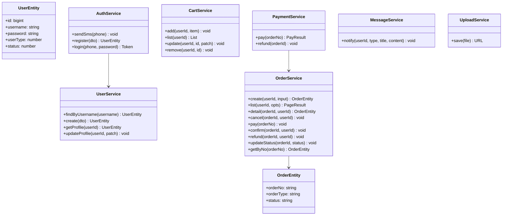

#### OrderService 代码级设计（核心契约类）

**属性**

| 属性 | 类型 | 说明 |
|---|---|---|
| orderModel | Repository\<OrderEntity\> | 订单表仓储（TypeORM） |
| itemModel | Repository\<OrderItemEntity\> | 订单明细表仓储 |
| messageService | MessageService | 消息服务（下单/支付通知） |

**方法**

| 方法 | 参数 | 返回 | 说明 |
|---|---|---|---|
| create | userId, CreateOrderInput | OrderEntity | 下单，生成订单号+明细快照 |
| list | userId, opts | PageResult\<OrderEntity\> | 分页查询我的订单 |
| detail | orderId, userId? | OrderEntity | 订单详情（含明细） |
| cancel | orderId, userId | void | 取消（仅 PENDING） |
| pay | orderNo | void | 支付（PENDING→PAID） |
| confirm | orderId, userId | void | 确认（PAID→FINISHED） |
| refund | orderId, userId | void | 退款（PAID→REFUNDED） |
| updateStatus | orderId, status | void | 业务中间态推进 |
| getByNo | orderNo | OrderEntity | 按订单号查询 |

**create 方法伪代码**

```
create(userId, input):
  1. 校验 input.items 非空，否则抛"订单明细为空"
  2. 服务端权威取价（见 ADR-5）：按 items[].entityId 逐一查 SKU/票种/房型当前价 serverPrice；
     客户端提交的 items[].price / totalAmount / payAmount 一律不作为计价依据（防改价下单），
     与服务端价不一致时抛 2003（提示"价格已变更，请刷新后重试"）
  3. 服务端重算金额并以此落库（不采信客户端金额）：
     totalAmount = Σ(serverPrice × quantity)；payAmount = totalAmount + 服务端运费（默认 0）
  4. orderNo = genOrderNo()   // 时间戳 + 6 位随机数
  5. order = orderModel.save({
       orderNo, userId, merchantId: input.merchantId, orderType: input.orderType,
       title: input.title || input.items[0].title,
       totalAmount, freightAmount, payAmount,
       status: 'PENDING', snapshot: input.snapshot || {}
     })
  6. itemModel.save(input.items.map(it => ({ orderId: order.id, ...it, price: serverPrice })))
     // 明细 price 为服务端价快照，非客户端提交值
  7. messageService.notify(userId, 'order', '下单成功', `订单 ${orderNo} 待支付`)
  8. return order
```

**cancel 方法伪代码**

```
cancel(orderId, userId):
  1. order = getOwn(orderId, userId)   // 校验订单归属
  2. if order.status != 'PENDING': throw 2004「仅待支付订单可取消」
  3. orderModel.update(orderId, { status: 'CANCELED' })
  4. 通知业务模块回补库存（事件/回调：衣/食回补 SKU 库存、住回补房态、行回补按日库存）
```

**pay 方法伪代码**

```
pay(orderNo):
  1. order = getByNo(orderNo)
  2. if order.status != 'PENDING': throw 2002「订单状态不可支付」
  3. orderModel.update(order.id, { status: 'PAID', payTime: now })
```

#### CartService 代码级设计

**属性**

| 属性 | 类型 | 说明 |
|---|---|---|
| cartModel | Repository\<CartItemEntity\> | 购物车表仓储 |

**方法**

| 方法 | 参数 | 返回 | 说明 |
|---|---|---|---|
| add | userId, item | void | 加入购物车（重复项数量累加） |
| list | userId | List\<CartItem\> | 我的购物车 |
| update | userId, id, patch | void | 改数量/勾选 |
| remove | userId, id | void | 删除项 |

**add 方法伪代码**

```
add(userId, item):
  1. exist = cartModel.findOne({ userId, module, entityType, entityId })
  2. if exist: exist.quantity += item.quantity; save(exist)
  3. else: save({ userId, ...item, checked: 1 })
```

#### PaymentService 代码级设计

**属性**

| 属性 | 类型 | 说明 |
|---|---|---|
| orderService | OrderService | 订单服务（状态联动） |
| paymentModel | Repository\<PaymentEntity\> | 支付表仓储 |

**方法**

| 方法 | 参数 | 返回 | 说明 |
|---|---|---|---|
| pay | orderNo | PayResult | mock 支付 |
| refund | orderId | void | mock 退款 |

**pay 方法伪代码**

```
pay(orderNo):
  1. order = orderService.getByNo(orderNo)
  2. if order.status != 'PENDING': throw 2002
  3. orderService.updateStatus(order.id, 'PAID')
  4. paymentModel.save({ orderId, orderNo, payType: 'wechat',
                          amount: order.payAmount, status: 'SUCCESS' })
  5. return { status: 'SUCCESS' }
```

### 5.1.2 下单时序图

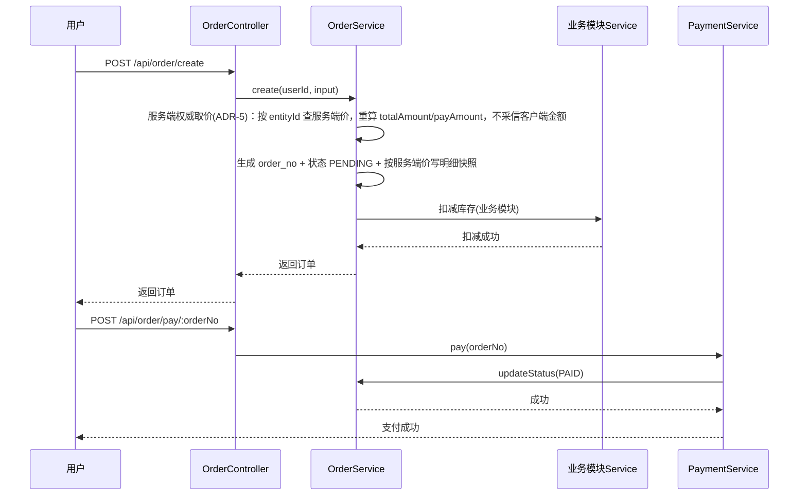

### 5.1.3 订单状态机

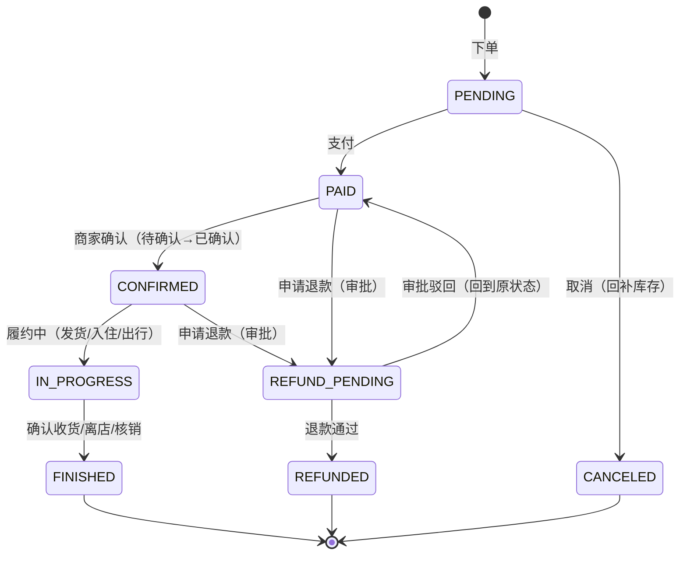

**状态枚举与需求对应**：需求要求「待确认 / 进行中」两个中间态，故完整状态机为 8 态：

| 状态 | 说明 | 对应需求 |
|---|---|---|
| PENDING | 待支付 | 待支付 |
| PAID | 已支付 | 已支付 |
| CONFIRMED | 已确认（商家确认） | 待确认/已确认 |
| IN_PROGRESS | 履约中（发货/入住/出行） | 进行中 |
| FINISHED | 已完成 | 已完成 |
| CANCELED | 已取消 | 已取消 |
| REFUND_PENDING | 退款审批中 | 已退款（审批环节） |
| REFUNDED | 已退款 | 已退款 |

> 退款审批：申请退款进入 `REFUND_PENDING`，管理员/商家审批通过后置 `REFUNDED`；部分退款（扣 50%/30%/10%）金额记录在 `base_order.refund_amount`。

### 5.1.4 注册登录时序图

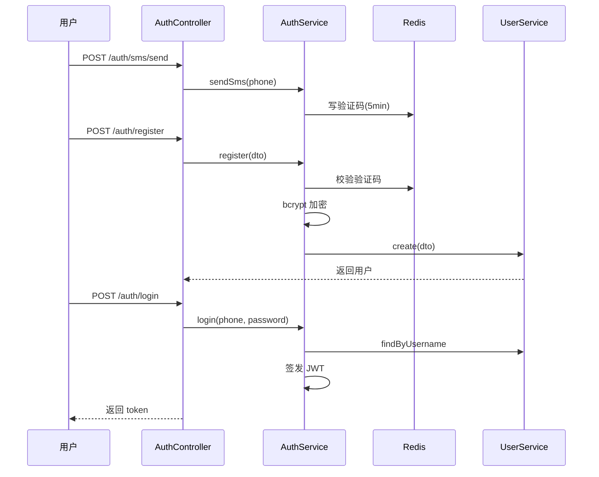

#### AuthService 代码级设计

**属性**

| 属性 | 类型 | 说明 |
|---|---|---|
| userService | UserService | 用户服务 |
| redisService | RedisService | Redis（验证码存储） |
| jwtService | JwtService | JWT 签发 |

**方法**

| 方法 | 参数 | 返回 | 说明 |
|---|---|---|---|
| sendSms | phone | void | 发验证码（mock 写 Redis） |
| register | dto | UserEntity | 注册 |
| login | phone, password | Token | 登录 |

**register 方法伪代码**

```
register(dto):
  1. 校验 password 匹配 /^(?=.*[A-Za-z])(?=.*\d)[A-Za-z\d]{8,20}$/，否则 throw 1003
  2. cached = redis.get(`sms:${dto.phone}`)
  3. if cached != dto.code: throw 1001「验证码错误或已过期」
  4. hashed = bcrypt.hash(dto.password, 10)
  5. return userService.create({ phone: dto.phone, password: hashed })
```

**login 方法伪代码**

```
login(phone, password):
  1. user = userService.findByUsername(phone)
  2. if !user: throw 1004「用户不存在」
  3. if !bcrypt.compare(password, user.password): throw 1005「密码错误」
  4. token = jwtService.sign({ id: user.id, username: user.username })
  5. return { token, user }
```

#### UserService 代码级设计

**属性**

| 属性 | 类型 | 说明 |
|---|---|---|
| userModel | Repository\<UserEntity\> | 用户表仓储 |

**方法**

| 方法 | 参数 | 返回 | 说明 |
|---|---|---|---|
| findByUsername | username | UserEntity\|null | 按手机号查 |
| create | dto | UserEntity | 创建用户 |
| getProfile | userId | UserEntity | 查个人资料 |
| updateProfile | userId, patch | void | 改资料 |

**findByUsername 方法伪代码**

```
findByUsername(username):
  1. return userModel.findOne({ username, delFlag: 0 })
```

**create 方法伪代码**

```
create(dto):
  1. if userModel.findOne({ username: dto.phone }): throw 1002「手机号已注册」
  2. return userModel.save({ username: dto.phone, password: dto.password, userType: 0 })
```

#### MessageService 代码级设计

**属性**

| 属性 | 类型 | 说明 |
|---|---|---|
| messageModel | Repository\<MessageEntity\> | 消息表仓储 |

**方法**

| 方法 | 参数 | 返回 | 说明 |
|---|---|---|---|
| notify | userId, type, title, content | void | 写入站内信 |
| list | userId | PageResult | 我的消息 |
| read | id | void | 标记已读 |

**notify 方法伪代码**

```
notify(userId, type, title, content):
  1. messageModel.save({ userId, type, title, content, isRead: 0 })
```

#### UploadService 代码级设计

**属性**

| 属性 | 类型 | 说明 |
|---|---|---|
| uploadModel | Repository\<UploadFileEntity\> | 上传文件表仓储 |

**方法**

| 方法 | 参数 | 返回 | 说明 |
|---|---|---|---|
| save | file | { url } | 存本地硬盘返回 URL |

**save 方法伪代码**

```
save(file):
  1. 校验类型（图片 jpg/png/webp ≤5MB；视频 mp4 ≤100MB ≤60s）
  2. 生成文件名 + 保存到 server/public/upload/
  3. url = `${host}/upload/${filename}`
  4. uploadModel.save({ url, filename, size, mime })
  5. return { url }
```

## 5.2 衣模块（goods）

### 5.2.1 类设计

```mermaid
classDiagram
    class GoodsService {
        +list(query) PageResult
        +detail(id) Goods
        +collect(userId, goodsId) void
        +evaluate(userId, dto) void
        +deductStock(skuId, quantity) void
        +restoreStock(skuId, quantity) void
    }
    class GoodsEntity {
        +title: string
        +price: decimal
        +stock: int
        +status: number
    }
    class GoodsSkuEntity {
        +goodsId: bigint
        +skuName: string
        +stock: int
    }
    class GoodsService --> GoodsEntity
    class GoodsService --> GoodsSkuEntity
    class GoodsService --> OrderService : "下单/扣库存"
```

#### GoodsService 代码级设计

**属性**

| 属性 | 类型 | 说明 |
|---|---|---|
| goodsModel | Repository\<GoodsEntity\> | 商品表仓储 |
| skuModel | Repository\<GoodsSkuEntity\> | SKU 表仓储 |
| evaluationModel | Repository\<GoodsEvaluationEntity\> | 评价表仓储 |
| orderService | OrderService | 订单服务（下单） |

**方法**

| 方法 | 参数 | 返回 | 说明 |
|---|---|---|---|
| list | query | PageResult\<Goods\> | 商品列表（分类/价格/销量筛选） |
| detail | id | Goods | 商品详情（含 SKU/图片） |
| collect | userId, goodsId | void | 收藏/取消（幂等） |
| evaluate | userId, dto | void | 评价（校验订单完成） |
| deductStock | skuId, quantity | void | 扣减 SKU 库存 |
| restoreStock | skuId, quantity | void | 回补 SKU 库存 |

**deductStock 方法伪代码（防超卖）**

```
deductStock(skuId, quantity):
  affected = skuModel.update(
    { id: skuId, stock: MoreThanOrEqual(quantity) },   // 条件更新
    { stock: () => 'stock - ' + quantity }
  )
  if affected == 0: throw「库存不足」
```

**restoreStock 方法伪代码**

```
restoreStock(skuId, quantity):
  skuModel.increment({ id: skuId }, 'stock', quantity)   // 回补库存
```

**collect 方法伪代码（收藏幂等）**

```
collect(userId, goodsId):
  1. exist = collectModel.findOne({ userId, goodsId })
  2. if exist: collectModel.delete(exist)   // 已收藏 → 取消
  3. else: collectModel.save({ userId, goodsId })
```

**evaluate 方法伪代码**

```
evaluate(userId, dto):
  1. order = orderService.detail(dto.orderId, userId)
  2. if order.status != 'FINISHED': throw「订单未完成不可评价」
  3. if evaluationModel.exists({ orderId: dto.orderId, goodsId: dto.goodsId }): throw「已评价」
  4. save({ orderId, goodsId, userId, score, content, images })
```

### 5.2.2 下单时序图

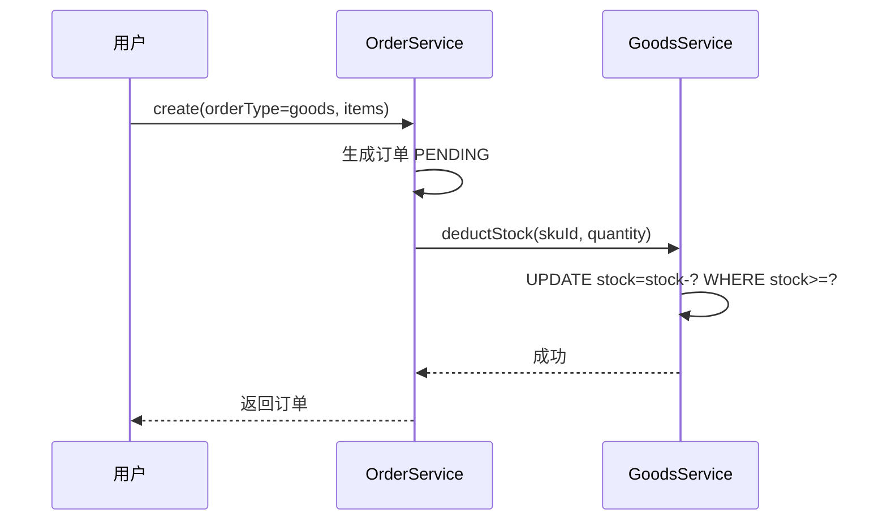

## 5.3 食模块（food）

### 5.3.1 类设计

```mermaid
classDiagram
    class FoodService {
        +restaurantList(query) PageResult
        +restaurantDetail(id) Restaurant
        +reserve(userId, dto) Order
        +productList(query) PageResult
        +productDetail(id) Product
    }
    class FoodRestaurantEntity {
        +name: string
        +address: string
        +capacity: int
    }
    class FoodProductEntity {
        +name: string
        +stock: int
        +origin: string
    }
    class FoodService --> FoodRestaurantEntity
    class FoodService --> FoodProductEntity
    class FoodService --> OrderService : "餐位预订 food_seat"
```

**FoodService 属性**

| 属性 | 类型 | 说明 |
|---|---|---|
| restaurantModel | Repository\<FoodRestaurantEntity\> | 餐厅表仓储 |
| productModel | Repository\<FoodProductEntity\> | 农产品表仓储 |
| orderService | OrderService | 订单服务（餐位预订/特产下单） |

**FoodService 方法表**

| 方法 | 参数 | 返回 | 说明 |
|---|---|---|---|
| restaurantList | query | PageResult | 餐厅列表（距离/评分/价格） |
| restaurantDetail | id | Restaurant | 餐厅详情（菜品/时段） |
| reserve | userId, dto | Order | 餐位预订 |
| productList | query | PageResult | 农产品列表 |
| productDetail | id | Product | 农产品详情 |

**reserve 方法伪代码**

```
reserve(userId, dto):
  1. if (date - now) < 2h: throw「餐位预订需提前至少 2 小时」
  2. 校验 timeSlot 剩余可订数 >= peopleCount
  3. order = orderService.create(orderType='food_seat',
           snapshot={ restaurantId, timeSlotId, date, peopleCount })
  4. return order
```

**restaurantList 方法伪代码**

```
restaurantList(query):
  1. 按 sort 参数排序：distance(按坐标算距离) / score / price
  2. return 分页查询（status=上架）
```

**productDetail 方法伪代码**

```
productDetail(id):
  1. product = productModel.findOne(id)
  2. return { ...product, origin: 产地溯源, shelfLife: 保质期 }
```

### 5.3.2 餐位预订时序图

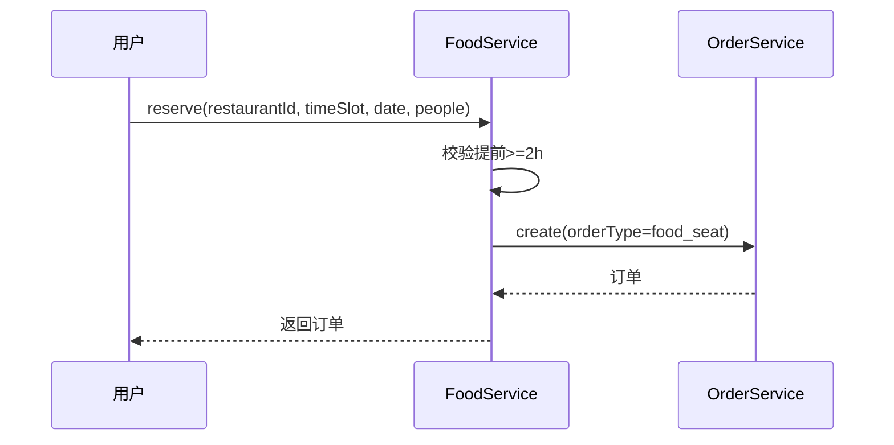

## 5.4 住模块（hotel）

### 5.4.1 类设计

```mermaid
classDiagram
    class HotelService {
        +list(query) PageResult
        +detail(id) Homestay
        +calendar(roomTypeId, start, end) List
        +reserve(userId, dto) Order
    }
    class HotelRoomCalendarEntity {
        +roomTypeId: bigint
        +date: date
        +stock: int
        +price: decimal
    }
    class HotelService --> HotelRoomCalendarEntity
    class HotelService --> OrderService : "预订 hotel"
```

**HotelService 属性**

| 属性 | 类型 | 说明 |
|---|---|---|
| homestayModel | Repository\<HotelHomestayEntity\> | 民宿表仓储 |
| roomTypeModel | Repository\<HotelRoomTypeEntity\> | 房型表仓储 |
| calendarModel | Repository\<HotelRoomCalendarEntity\> | 房态日历表仓储 |
| orderService | OrderService | 订单服务（预订） |

**HotelService 方法表**

| 方法 | 参数 | 返回 | 说明 |
|---|---|---|---|
| list | query | PageResult | 民宿列表（筛选/排序） |
| detail | id | Homestay | 民宿详情（房型/须知） |
| calendar | roomTypeId, start, end | List | 房态日历 |
| reserve | userId, dto | Order | 预订（预付） |

**reserve 方法伪代码**

```
reserve(userId, dto):
  1. for date in [checkin, checkout): 校验 hotel_room_calendar.stock > 0
  2. order = orderService.create(orderType='hotel', snapshot={ checkin, checkout, roomTypeId })
  3. for date in [checkin, checkout): 逐日扣减房态库存 stock--
```

**calendar 方法伪代码**

```
calendar(roomTypeId, start, end):
  1. return calendarModel.find({ roomTypeId, date: Between(start, end) })
       .map(→ { date, stock, price })   // 只返回有房日期
```

### 5.4.2 预订时序图

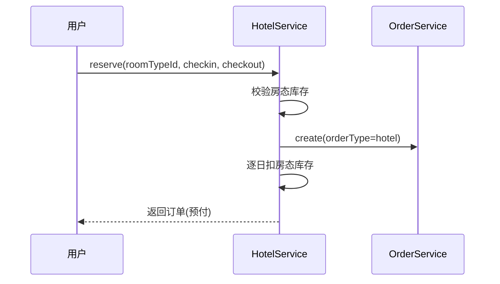

## 5.5 行模块（travel）

### 5.5.1 类设计

```mermaid
classDiagram
    class TravelService {
        +scenicList(query) PageResult
        +ticketBuy(userId, dto) Order
        +routeBuy(userId, dto) Order
        +eticket(orderId) Eticket
        +verify(eticketNo) void
    }
    class TravelEticketEntity {
        +orderId: bigint
        +qrCode: string
        +status: string
    }
    class TravelService --> TravelEticketEntity
    class TravelService --> OrderService : "门票 ticket / 路线 route"
```

**TravelService 属性**

| 属性 | 类型 | 说明 |
|---|---|---|
| scenicModel | Repository\<TravelScenicEntity\> | 景区表仓储 |
| ticketTypeModel | Repository\<TravelTicketTypeEntity\> | 票种表仓储 |
| routeModel | Repository\<TravelRouteEntity\> | 路线表仓储 |
| eticketModel | Repository\<TravelEticketEntity\> | 电子票表仓储 |
| orderService | OrderService | 订单服务（门票/路线） |

**TravelService 方法表**

| 方法 | 参数 | 返回 | 说明 |
|---|---|---|---|
| scenicList | query | PageResult | 景区+门票列表 |
| ticketBuy | userId, dto | Order | 门票购买 |
| routeBuy | userId, dto | Order | 路线购买 |
| eticket | orderId | Eticket | 电子票查询 |
| verify | eticketNo | void | 电子票核销 |

**verify 方法伪代码**

```
verify(eticketNo):
  1. eticket = findByNo(eticketNo)
  2. if eticket.status != 'UNUSED': throw「电子票已使用或已退」
  3. if eticket.validDate != today: throw「不在有效期」
  4. update status = 'USED'
```

**ticketBuy 方法伪代码**

```
ticketBuy(userId, dto):
  1. 校验按使用日期库存（travel_ticket_type 按日期分库存）
  2. order = orderService.create(orderType='ticket', snapshot={ ticketTypeId, useDate, visitors })
  3. 扣减对应日期库存
  4. 生成电子票 eticketModel.save({ orderId, qrCode, validDate: useDate })
```

**refund 方法伪代码**

```
refund(orderId):
  1. eticket = eticketModel.findOne({ orderId })
  2. if eticket.status != 'UNUSED': throw「不可退」
  3. if (validDate - now) >= 24h: 扣 10% 手续费
     else: throw「使用前 24 小时内不可退」
  4. orderService.refund(orderId) + eticket.status='REFUNDED'
```

### 5.5.2 电子票核销时序图

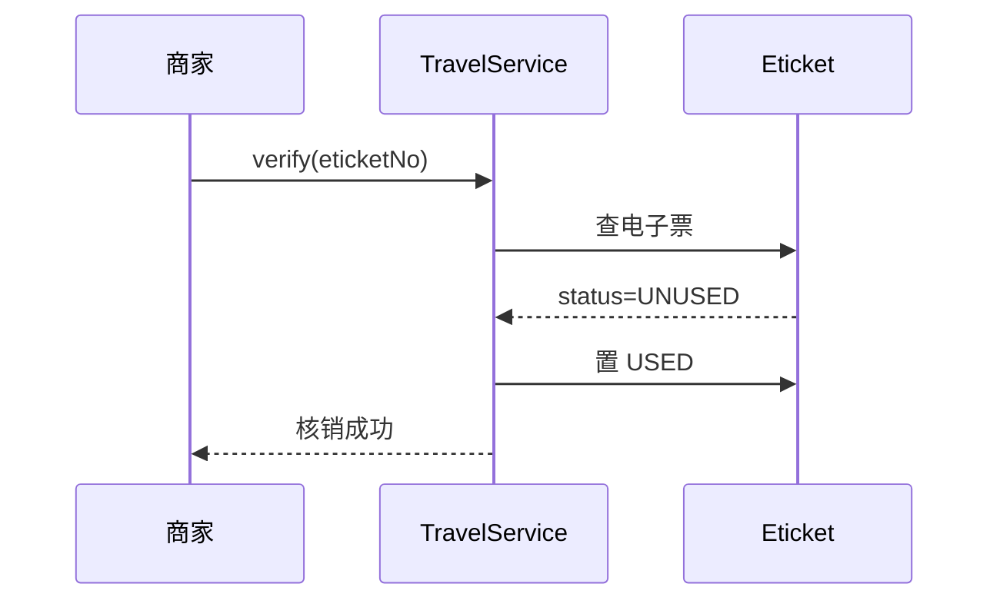

## 5.6 社区模块（community）

### 5.6.1 类设计

```mermaid
classDiagram
    class CommunityService {
        +feed(sort) PageResult
        +publish(userId, dto) Post
        +postDetail(id) Post
        +comment(userId, dto) void
        +like(userId, targetType, targetId) void
        +follow(userId, followUserId) void
        +report(userId, dto) void
    }
    class CommunityPostEntity {
        +userId: bigint
        +content: text
        +status: string
    }
    class CommunityService --> CommunityPostEntity
    class CommunityService --> UploadService : "图片/视频"
```

**CommunityService 属性**

| 属性 | 类型 | 说明 |
|---|---|---|
| postModel | Repository\<CommunityPostEntity\> | 游记表仓储 |
| commentModel | Repository\<CommunityCommentEntity\> | 评论表仓储 |
| likeModel | Repository\<CommunityLikeEntity\> | 点赞表仓储 |
| followModel | Repository\<CommunityFollowEntity\> | 关注表仓储 |
| uploadService | UploadService | 上传服务（图片/视频） |

**CommunityService 方法表**

| 方法 | 参数 | 返回 | 说明 |
|---|---|---|---|
| feed | sort | PageResult | 信息流（最新/热度） |
| publish | userId, dto | Post | 发布游记 |
| postDetail | id | Post | 游记详情 |
| comment | userId, dto | void | 评论（二级回复） |
| like | userId, targetType, targetId | void | 点赞/取消 |
| follow | userId, followUserId | void | 关注/取关 |
| report | userId, dto | void | 举报 |

**publish 方法伪代码**

```
publish(userId, dto):
  1. 校验 content.length <= 5000、images.length <= 9、视频 <= 60s
  2. 校验当日发布数 < 10
  3. 文字敏感词机审: 命中 → status='PENDING'; 未命中 → 继续
  4. 图片机审（ContentReviewProvider 适配器）:
     - 默认实现 LocalImageMock（诚实模拟）: 校验图片可访问性/格式/大小 + 扩展名黑名单；
       不做视觉识别，结果记 status='IMAGE_UNREVIEWED'，后台人工审核队列兜底
     - 预留腾讯云图片内容安全（CMS）接入位，配置密钥后自动分流云审
  5. 视频: 抽首帧按图片同通道送审
  6. save(post)；审核不通过/待审 → status='PENDING' 转人工
```

**禁言规则**：敏感词命中 3 次 → `base_sys_user.mute_until = now + 24h`，禁言期间发布/评论接口统一拦截。

**comment 方法伪代码**

```
comment(userId, dto):
  1. 校验 content.length <= 500、敏感词过滤
  2. save({ postId, userId, content, replyCommentId: dto.replyCommentId || 0 })
  3. postModel.increment(postId, 'commentCount', 1)
```

**like 方法伪代码（点赞幂等）**

```
like(userId, targetType, targetId):
  1. exist = likeModel.findOne({ userId, targetType, targetId })
  2. if exist: delete(exist); target.likeCount--
  3. else: save(...); target.likeCount++
```

### 5.6.2 发布审核时序图

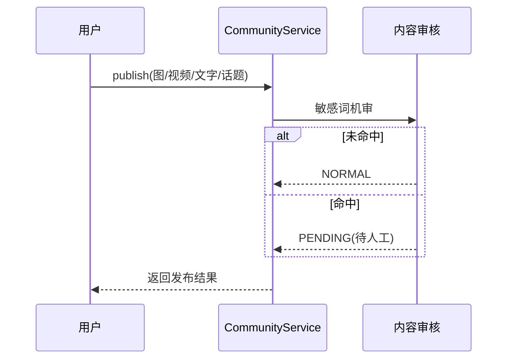

## 5.7 管理后台（admin）

### 5.7.1 类设计

```mermaid
classDiagram
    class AdminService {
        +merchantAudit(applyId, approve, reason) void
        +userManage(userId, action) void
        +dashboard(type) Stat
        +financeSettle() void
        +bannerManage(dto) void
    }
    class MerchantApplyEntity {
        +status: string
        +rejectReason: string
    }
    class FinanceRecordEntity {
        +commission: decimal
        +settleStatus: string
    }
    class AdminService --> MerchantApplyEntity
    class AdminService --> FinanceRecordEntity
```

**AdminService 属性**

| 属性 | 类型 | 说明 |
|---|---|---|
| merchantApplyModel | Repository\<MerchantApplyEntity\> | 入驻申请表仓储 |
| merchantModel | Repository\<MerchantEntity\> | 商家表仓储 |
| financeModel | Repository\<FinanceRecordEntity\> | 财务记录表仓储 |
| userService | UserService | 用户服务 |

**AdminService 方法表**

| 方法 | 参数 | 返回 | 说明 |
|---|---|---|---|
| merchantAudit | applyId, approve, reason | void | 商家入驻审核 |
| userManage | userId, action | void | 用户封禁/解封 |
| dashboard | type | Stat | 数据看板 |
| financeSettle | — | void | 生成结算单（T+7） |
| bannerManage | dto | void | 轮播/推荐/公告 |

**merchantAudit 方法伪代码**

```
merchantAudit(applyId, approve, reason):
  1. apply = applyModel.findOne(applyId)
  2. if approve:
       merchantModel.save({ userId: apply.userId, shopName, module })
       userModel.update(apply.userId, { userType: 1 })
       apply.status = 'APPROVED'
     else:
       apply.status = 'REJECTED'; apply.rejectReason = reason
```

**financeSettle 方法伪代码**

```
financeSettle():
  1. 查未结算订单（settle_status=PENDING）
  2. commission = orderAmount × (实物 5% / 服务类 10%)
  3. merchantIncome = orderAmount - commission
  4. 生成结算单 → settle_status='SETTLED'
```

**dashboard 方法伪代码**

```
dashboard(type):
  1. overview: 统计 DAU、新增用户、订单数、GMV
  2. order: 按模块统计订单量、GMV、转化率
  3. finance: 统计总流水、平台收入、待结算金额
  4. return 对应指标
```

**bannerManage 方法伪代码**

```
bannerManage(dto):
  1. 校验图片 URL、跳转链接
  2. save/update/delete 轮播图（sort 排序）
```

### 5.7.2 商家入驻审核时序图

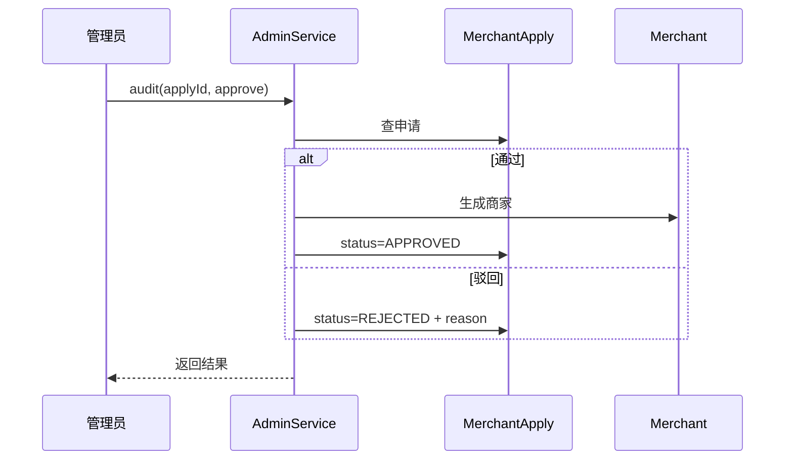

---

## 5.8 核心逻辑说明（事务 / 缓存 / 定时 / 并发）

### 5.8.1 事务处理

以下操作必须放在同一事务中，任一失败整体回滚：

| 场景 | 事务范围 | 回滚条件 |
|---|---|---|
| 下单 | 订单创建 + 订单明细 + 扣减库存 | 任一失败回滚 |
| 支付 | 订单状态更新 + 支付记录写入 | 任一失败回滚 |
| 退款 | 订单状态更新 + 库存回补 + 支付记录更新 | 任一失败回滚 |
| 商家审核 | 申请状态更新 + 商家生成 + 用户类型更新 | 任一失败回滚 |

### 5.8.2 缓存策略

| 数据 | 缓存介质 | 过期时间 | 说明 |
|---|---|---|---|
| 短信验证码 | Redis | 5 分钟 | key `sms:{phone}` |
| 登录 Token | Redis | 7 天 | 与 JWT 过期一致 |
| 商品/民宿热点数据 | Redis | 10 分钟 | 列表页缓存 |
| 热搜词 | Redis | 1 天 | 管理员配置 |
| 库存原子键 | Redis | 持久 | `stock:sku:{id}` / `room:{roomTypeId}:{date}` / `ticket:{typeId}:{date}` / `route:{routeId}:{date}` / `seat:{restaurantId}:{date}:{slotId}`，扣减/释放用 Lua 原子操作（见 5.8.4） |
| 首页聚合 | Redis | 60 秒 | key `cache:home:{端}`，运营改动 Banner/推荐位后主动失效 |
| 详情页缓存 | Redis | 5 分钟 | key `cache:detail:{module}:{id}`，数据变更时主动失效 |
| RBAC 权限码 | Redis | 启动加载 | key `perm:{role}`，角色权限变更时失效 |
| 未读消息数 | Redis | 持久 | key `msg:unread:{userId}`，新消息 INCR、已读清零 |

### 5.8.3 定时任务

| 任务 | 执行时间 | 说明 |
|---|---|---|
| 数据备份 | 每日凌晨 | MySQL 备份保留 30 天 |
| 财务结算单生成 | 每日（T+7 周期） | 生成待结算单 |
| 订单超时关单 | 每 10 分钟 | PENDING 超 30 分钟自动取消：**复用 OrderService.cancel() 同一逻辑**（状态流转 + 回补库存 + 幂等释放标记），不另写第二套取消代码 |

### 5.8.4 并发注意点

| 场景 | 处理方式 |
|---|---|
| 防超卖（第一道） | Redis Lua 脚本原子扣减可用库存/余位（单资源单键，住宿多晚 = 多键同一脚本，任一不足整体失败），不足则下单直接失败 |
| 防超卖（第二道兜底） | 扣库存用条件更新 `UPDATE ... WHERE stock >= quantity`，影响行数为 0 则失败：回滚事务并回补 Redis |
| Redis 与 DB 一致性 | 先 Redis 后 DB；DB 事务失败补偿回补 Redis；超时关单/取消/退款释放库存做幂等（订单上记释放标记，防重复释放） |
| 防重复提交 | 收藏/点赞用唯一键；下单用订单号幂等 |
| 防重复下单 | 前端按钮防抖 + 后端幂等校验 |
| 防重复评价 | 评价表唯一键 (order_id, goods_id) |
| 房态并发预订 | 多晚逐日扣减：Redis 多键 Lua 一次原子扣减，任一晚不足整体失败；DB 侧房态日历条件更新兜底，逐日失败则整体回滚 |

### 5.8.5 性能指标实现手段（对应 2.2.1 各项指标）

| 指标 | 实现手段 | 验证方式 |
|---|---|---|
| 首页加载 ≤ 2s | 首页聚合缓存（60s，见 5.8.2）；Nginx gzip + 静态资源强缓存；图片按 5.2.3 缩略图方案出多档尺寸 | 浏览器 DevTools Network 面板记录首屏时间，取 10 次平均 |
| 95% 接口 ≤ 500ms | 4.6 索引设计覆盖高频查询；列表接口分页 + 只查必要字段；热点读走缓存；MySQL 连接池（默认连接数上调至 20） | 接口压测报告统计 P95 分位 |
| 支持 1000 并发用户 | PM2 cluster 多实例（CPU 核数）+ Nginx 反向代理分流；库存扣减走 Redis Lua 避免行锁堆积；写接口按用户限流（Redis 滑动窗口，60 次/分）防打爆 | autocannon 压测（见下） |
| 搜索 ≤ 1s | 组合索引 + LIKE 前缀匹配 / FULLTEXT(ngram)；搜索结果页缓存 60s；SQL 上线前 EXPLAIN 审查（杜绝全表扫描） | 搜索接口压测 P95 ≤ 1s |

**压测方法（验收口径）**：使用 `autocannon`（`npx autocannon -c 100 -d 30 http://localhost:7001/api/goods/list`，-c 并发数、-d 持续秒数）对「商品列表 / 民宿详情 / 下单+支付回调」三类接口各压 30 秒；并发 500~1000 档位各跑一轮，断言：无 5xx、库存字段不为负、成功订单数 = 成功扣减数、P95 达标。压测脚本与结果（截图/JSON）存 `docs/perf/`，作为验收材料。

---

# 第 6 章 界面设计

## 6.1 小程序端

### 6.1.1 页面清单

| 页面 | 归属模块 | 主要功能 |
|---|---|---|
| 首页 | 公共 | Banner 轮播、金刚区（衣食住行社区）、热门推荐 |
| 分类页 | 衣 | 一级+二级分类树 |
| 商品列表页 | 衣 | 分类/价格/销量/评分筛选、分页 |
| 搜索页 | 公共 | 关键词 + 历史 + 热搜 |
| 商品详情页 | 衣 | 轮播、SKU 选择、工艺、传承人故事、评价 |
| 购物车页 | 公共 | 增删改、勾选、结算 |
| 订单确认页 | 公共 | 收货地址、金额、提交 |
| 餐厅列表/详情 | 食 | 距离排序、地图、菜品、时段 |
| 餐位预订页 | 食 | 选日期→时段→人数→填信息 |
| 农产品列表/详情 | 食 | 分类、产地溯源、加购 |
| 民宿列表/详情 | 住 | 筛选、地图、房型、房态日历 |
| 民宿预订页 | 住 | 选房型→日期→入住人 |
| 景区/门票 | 行 | 票种、日期、数量 |
| 路线列表/详情 | 行 | 行程、包含项目 |
| 电子票 | 行 | 二维码、核销状态 |
| 社区信息流 | 社区 | 瀑布流/视频流 |
| 发布游记 | 社区 | 图/视频、文字、话题 |
| 游记详情 | 社区 | 点赞/评论/收藏/分享 |
| 话题页 | 社区 | 话题聚合 |
| 个人主页 | 社区 | 游记、获赞、关注、粉丝 |
| 我的 | 公共 | 订单、收藏、评价、地址、消息、设置 |

### 6.1.2 小程序页面跳转关系

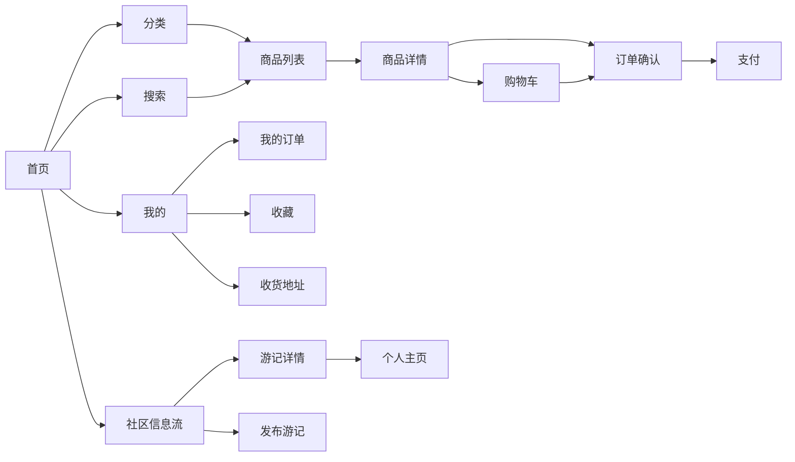

## 6.2 PC 网页端

### 6.2.1 页面清单

| 页面 | 归属模块 | 主要功能 |
|---|---|---|
| 首页 | 公共 | 顶部导航、Banner、模块入口卡片、推荐 |
| 商品分类筛选页 | 衣 | 多条件组合筛选 |
| 商品详情大图页 | 衣 | 大图、富文本、SKU 选择、加购 |
| 购物车 | 公共 | 增删改、合计、结算 |
| 美食地图 | 食 | 地图展示餐厅分布 |
| 餐厅详情大图页 | 食 | 大图、菜品、餐位预订 |
| 农产品列表/详情 | 食 | 分类、筛选、大图、加购 |
| 民宿地图 | 住 | 民宿位置 |
| 房源大图页 | 住 | 轮播、房型对比、日历选房 |
| 路线详情大图页 | 行 | 大图、富文本行程、套餐对比 |
| 门票选购 | 行 | 景区筛选、票种选择 |
| 游记瀑布流/详情 | 社区 | 大图瀑布流、评论 |
| 个人中心 | 公共 | 订单、收藏、评价 |

## 6.3 管理后台

### 6.3.1 页面清单

| 页面 | 归属 | 主要功能 |
|---|---|---|
| 商家登录 | 框架 | 账号密码登录 |
| 商家工作台 | 框架 | 今日订单数、待发货、营业额 |
| 用户管理 | 管理 | 列表、封禁/解封 |
| 商家管理 | 管理 | 列表、入驻审核 |
| 角色权限 | 管理 | RBAC 角色与权限分配 |
| 数据看板 | 管理 | 总览/订单/用户/内容/财务（Echarts） |
| 首页运营 | 管理 | 轮播图、推荐位、公告 |
| 财务结算 | 管理 | 结算列表、结算单、报表 |
| 全局订单 | 管理 | 跨模块查询、退款审批 |
| 系统设置 | 管理 | 抽佣/运费/支付/短信/敏感词 |
| 商品/分类/库存管理 | 衣 | 商品 CRUD、SKU、库存预警 |
| 餐厅/时段/预订管理 | 食 | 餐厅、时段、预订确认 |
| 民宿/房型/房态管理 | 住 | 民宿、房型、房态日历 |
| 景区/票种/路线/核销 | 行 | 票务、电子票核销 |
| 内容审核/话题/举报 | 社区 | 审核、话题、举报处理 |

### 6.3.2 关键页面字段级说明

#### 商品详情页（小程序）

| 元素 | 类型 | 数据来源 / 说明 |
|---|---|---|
| 主图轮播 | 图片轮播 | goods.main_image + goods_image 列表 |
| 标题 | 文本 | goods.title |
| 价格区 | 文本 | price 售价 + market_price 市场价（划线展示） |
| 销量/评分 | 文本 | sales 销量 + 评分 |
| 库存提示 | 文本 | 库存不足时红色提示 |
| SKU 选择器 | 选择器 | goods_sku.sku_name，切换联动价格/库存 |
| 数量选择 | 步进器 | 购买数量（受库存限制） |
| 加入购物车 | 按钮 | 调 POST /api/cart/add |
| 立即购买 | 按钮 | 调 POST /api/order/create |
| 收藏 | 图标按钮 | 调 POST /api/goods/collect（幂等切换） |
| 工艺介绍 | 富文本 | goods.craft_intro |
| 传承人故事 | 文本 | goods.inheritor_name + inheritor_story |
| 详情 | 富文本 | goods.detail |
| 评价列表 | 列表 | GET /api/goods/evaluation/:goodsId |

#### 民宿预订页（小程序）

| 元素 | 类型 | 数据来源 / 说明 |
|---|---|---|
| 房型列表 | 列表 | hotel_room_type（名称/床型/面积/价格） |
| 房态日历 | 日历 | GET /api/hotel/calendar/:roomTypeId |
| 入住/离店日期 | 日期选择 | checkin/checkout |
| 入住人数 | 步进器 | peopleCount |
| 联系人 | 输入框 | contactName |
| 联系电话 | 输入框 | contactPhone |
| 身份证号 | 输入框 | idCard（脱敏展示） |
| 提交预订 | 按钮 | POST /api/hotel/reserve |

#### 发布游记页（小程序）

| 元素 | 类型 | 数据来源 / 说明 |
|---|---|---|
| 图片上传 | 上传 | POST /api/upload/image（≤9 张） |
| 视频上传 | 上传 | POST /api/upload/video（≤60s） |
| 标题 | 输入框 | title |
| 文字内容 | 多行输入 | content（≤5000 字） |
| 话题标签 | 标签选择 | topicTags |
| 关联地点 | 选择器 | relatedLocation（餐厅/民宿/景区） |
| 发布按钮 | 按钮 | POST /api/community/post |

#### 餐位预订页（小程序）

| 元素 | 类型 | 数据来源 / 说明 |
|---|---|---|
| 日期选择 | 日期 | date |
| 时段选择 | 选择器 | food_time_slot.name |
| 人数 | 步进器 | peopleCount |
| 姓名 | 输入框 | name |
| 电话 | 输入框 | phone |
| 备注 | 输入框 | remark |
| 提交预订 | 按钮 | POST /api/food/reserve |

### 6.3.3 管理后台菜单结构

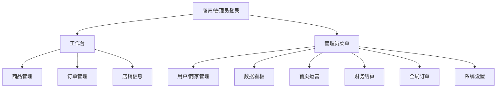

---

# 第 7 章 接口设计

## 7.1 接口规范

- 统一返回结构：`{ code, message, data }`，`code=0` 表示成功。
- 鉴权：前端在请求头传 `Authorization: Bearer <JWT>`；管理后台走 RBAC。
- 路由前缀：`/api/{module}/...`。
- 参数校验用 DTO；错误码集中在 base 定义。
- 时间格式 `yyyy-MM-dd HH:mm:ss`；金额单位「元」。

## 7.2 错误码定义

| code | 说明 |
|---|---|
| 0 | 成功 |
| 401 | 未登录 / 登录失效 |
| 403 | 无权限 |
| 1001 | 验证码错误或已过期 |
| 1002 | 手机号已注册 |
| 1003 | 密码规则不符（8-20 位含字母与数字） |
| 1004 | 用户不存在 |
| 1005 | 密码错误 |
| 2001 | 订单不存在 |
| 2002 | 订单状态不可操作 |
| 2003 | 订单金额校验失败 |
| 2004 | 仅待支付订单可取消 |
| 2005 | 仅已支付订单可退款/确认 |
| 3001 | 购物车项不存在 |
| 4001 | 文件类型/大小不合法 |

## 7.3 base 公共接口

### 7.3.1 认证接口

#### 发送验证码

**接口描述**

| 项目 | 内容 |
|---|---|
| 接口名称 | 发送短信验证码 |
| 请求地址 | /api/auth/sms/send |
| 请求方式 | POST |
| 请求头 | 无 |
| 请求参数 | phone |
| 备注 | 验证码写 Redis（5 分钟有效），日志输出（mock） |

**请求参数**

| 参数名 | 类型 | 是否必须 | 备注 |
|---|---|---|---|
| phone | string | 是 | 手机号，11 位 |

**返回示例**

```json
{ "code": 0, "message": "ok", "data": null }
```

#### 注册

**接口描述**

| 项目 | 内容 |
|---|---|
| 接口名称 | 用户注册 |
| 请求地址 | /api/auth/register |
| 请求方式 | POST |
| 请求头 | 无 |
| 请求参数 | phone, code, password |
| 备注 | 密码 8-20 位含字母数字；验证码校验；手机号唯一 |

**请求参数**

| 参数名 | 类型 | 是否必须 | 备注 |
|---|---|---|---|
| phone | string | 是 | 手机号 |
| code | string | 是 | 短信验证码（6 位） |
| password | string | 是 | 密码，8-20 位含字母与数字 |

**返回示例**

```json
{
  "code": 0,
  "message": "ok",
  "data": { "id": 1, "username": "13800000001" }
}
```

#### 登录

**接口描述**

| 项目 | 内容 |
|---|---|
| 接口名称 | 用户登录 |
| 请求地址 | /api/auth/login |
| 请求方式 | POST |
| 请求头 | 无 |
| 请求参数 | phone, password |
| 备注 | bcrypt 比对密码，签发 JWT |

**请求参数**

| 参数名 | 类型 | 是否必须 | 备注 |
|---|---|---|---|
| phone | string | 是 | 手机号 |
| password | string | 是 | 密码 |

**返回示例**

```json
{
  "code": 0,
  "message": "ok",
  "data": {
    "token": "eyJhbGciOiJIUzI1NiIs...",
    "user": { "id": 1, "nickname": "游客小明", "avatar": "http://..." }
  }
}
```

#### 微信登录（预留）

**接口描述**

| 项目 | 内容 |
|---|---|
| 接口名称 | 微信授权登录 |
| 请求地址 | /api/auth/wechat/login |
| 请求方式 | POST |
| 请求头 | 无 |
| 请求参数 | code |
| 备注 | code 换 openid，首次登录自动注册 |

**请求参数**

| 参数名 | 类型 | 是否必须 | 备注 |
|---|---|---|---|
| code | string | 是 | wx.login 获取的 code |

**返回示例**

```json
{
  "code": 0,
  "message": "ok",
  "data": { "token": "eyJhbGciOi...", "user": { "id": 1 } }
}
```

#### 个人信息

**接口描述**

| 项目 | 内容 |
|---|---|
| 接口名称 | 查/改个人信息 |
| 请求地址 | /api/auth/profile |
| 请求方式 | GET / PUT |
| 请求头 | Authorization: Bearer \<token\> |
| 请求参数 | nickname, avatar, gender, region, bio |
| 备注 | 需登录；PUT 修改昵称/头像/性别/地区/简介 |

**请求参数（PUT）**

| 参数名 | 类型 | 是否必须 | 备注 |
|---|---|---|---|
| nickname | string | 否 | 昵称 |
| avatar | string | 否 | 头像 URL |
| gender | number | 否 | 0 未知 / 1 男 / 2 女 |
| region | string | 否 | 地区 |
| bio | string | 否 | 简介 |

**返回示例**

```json
{
  "code": 0,
  "message": "ok",
  "data": { "id": 1, "nickname": "游客小明", "avatar": "http://...", "gender": 1 }
}
```

### 7.3.2 商家入驻接口

#### 申请入驻

**接口描述**

| 项目 | 内容 |
|---|---|
| 接口名称 | 商家入驻申请 |
| 请求地址 | /api/merchant/apply |
| 请求方式 | POST |
| 请求头 | Authorization: Bearer \<token\> |
| 请求参数 | shopName, module, contact, phone, qualification |
| 备注 | 需登录（游客）；提交后待管理员审核 |

**请求参数**

| 参数名 | 类型 | 是否必须 | 备注 |
|---|---|---|---|
| shopName | string | 是 | 店铺名 |
| module | string | 是 | 衣/食/住/行 |
| contact | string | 是 | 联系人 |
| phone | string | 是 | 联系电话 |
| qualification | object | 是 | 资质材料（身份证/营业执照 URL） |

**返回示例**

```json
{
  "code": 0,
  "message": "ok",
  "data": { "id": 1, "status": "PENDING" }
}
```

#### 入驻审核

**接口描述**

| 项目 | 内容 |
|---|---|
| 接口名称 | 商家入驻审核 |
| 请求地址 | /api/admin/merchant/audit |
| 请求方式 | POST |
| 请求头 | Authorization: Bearer \<token\> |
| 请求参数 | applyId, approve, reason |
| 备注 | 需管理员权限（RBAC）；通过生成商家+用户类型置 1 |

**请求参数**

| 参数名 | 类型 | 是否必须 | 备注 |
|---|---|---|---|
| applyId | number | 是 | 申请 ID |
| approve | boolean | 是 | true 通过 / false 驳回 |
| reason | string | 否 | 驳回原因 |

**返回示例**

```json
{ "code": 0, "message": "ok", "data": null }
```

#### 商家订单查询

**接口描述**

| 项目 | 内容 |
|---|---|
| 接口名称 | 商家查询自己的订单 |
| 请求地址 | /api/merchant/order/list |
| 请求方式 | GET |
| 请求头 | Authorization: Bearer \<token\> |
| 请求参数 | orderType, status, page, size |
| 备注 | 需商家权限；按 merchant_id 过滤，商家只能看自己名下订单 |

**请求参数**

| 参数名 | 类型 | 是否必须 | 备注 |
|---|---|---|---|
| orderType | string | 否 | 订单类型筛选 |
| status | string | 否 | 状态筛选 |
| page | number | 否 | 页码（默认 1） |
| size | number | 否 | 每页条数（默认 10） |

**返回示例**

```json
{
  "code": 0, "message": "ok",
  "data": {
    "list": [{ "id": 1, "orderNo": "20260908...", "orderType": "goods", "title": "苗族银饰手镯", "status": "PAID", "payAmount": 299.00, "createTime": "2026-09-08 10:30:00" }],
    "total": 10, "page": 1, "size": 10
  }
}
```

### 7.3.3 订单接口

#### 下单

**接口描述**

| 项目 | 内容 |
|---|---|
| 接口名称 | 创建订单 |
| 请求地址 | /api/order/create |
| 请求方式 | POST |
| 请求头 | Authorization: Bearer \<token\> |
| 请求参数 | orderType, title, items, totalAmount, freightAmount, payAmount, snapshot |
| 备注 | 生成 PENDING 订单；金额以服务端权威取价为准（ADR-5）；业务模块随后扣库存 |

**请求参数**

| 参数名 | 类型 | 是否必须 | 备注 |
|---|---|---|---|
| orderType | string | 是 | goods/food_seat/hotel/ticket/route |
| title | string | 否 | 订单标题 |
| items | array | 是 | 订单明细列表 |
| items[].module | string | 是 | 来源模块 goods/food/hotel/travel |
| items[].entityType | string | 是 | 实体类型枚举：goods_sku / product_sku / seat / room_type / ticket_type / route（须与 4.4 base_order_item.entity_type 一致） |
| items[].entityId | number | 是 | 实体 ID |
| items[].title | string | 是 | 标题快照 |
| items[].specName | string | 否 | 规格名 |
| items[].price | number | 是 | 单价（仅用于前端展示与比对校验；服务端按 entityId 重新取价，不一致返回 2003，落库为服务端价快照） |
| items[].quantity | number | 是 | 数量 |
| totalAmount | number | 是 | 总额（仅用于比对校验，服务端按 Σ(服务端价 × 数量) 重算，见 ADR-5） |
| freightAmount | number | 否 | 运费（默认 0，以服务端运费规则为准） |
| payAmount | number | 是 | 实付金额（仅用于比对校验，服务端按 totalAmount + 运费 重算，见 ADR-5） |
| snapshot | object | 否 | 模块扩展快照 |

**返回示例**

```json
{
  "code": 0,
  "message": "ok",
  "data": { "id": 1, "orderNo": "20260908103000123456", "status": "PENDING", "payAmount": 299.00 }
}
```

#### 订单列表

**接口描述**

| 项目 | 内容 |
|---|---|
| 接口名称 | 我的订单列表 |
| 请求地址 | /api/order/list |
| 请求方式 | GET |
| 请求头 | Authorization: Bearer \<token\> |
| 请求参数 | orderType, status, page, size |
| 备注 | 分页；按 orderType/status 筛选 |

**请求参数**

| 参数名 | 类型 | 是否必须 | 备注 |
|---|---|---|---|
| orderType | string | 否 | 订单类型筛选 |
| status | string | 否 | 状态筛选 |
| page | number | 否 | 页码（默认 1） |
| size | number | 否 | 每页条数（默认 10） |

**返回示例**

```json
{
  "code": 0,
  "message": "ok",
  "data": {
    "list": [{ "id": 1, "orderNo": "20260908...", "title": "苗族银饰手镯", "orderType": "goods", "payAmount": 299.00, "status": "PENDING", "createTime": "2026-09-08 10:30:00" }],
    "total": 10, "page": 1, "size": 10
  }
}
```

#### 订单详情

**接口描述**

| 项目 | 内容 |
|---|---|
| 接口名称 | 订单详情 |
| 请求地址 | /api/order/detail/:id |
| 请求方式 | GET |
| 请求头 | Authorization: Bearer \<token\> |
| 请求参数 | - |
| 备注 | 含订单明细与快照 |

**返回示例**

```json
{
  "code": 0,
  "message": "ok",
  "data": {
    "id": 1, "orderNo": "20260908...", "orderType": "goods", "status": "PENDING",
    "items": [{ "title": "苗族银饰手镯", "specName": "中号", "price": 299.00, "quantity": 1 }]
  }
}
```

#### 取消订单

**接口描述**

| 项目 | 内容 |
|---|---|
| 接口名称 | 取消订单 |
| 请求地址 | /api/order/cancel/:id |
| 请求方式 | POST |
| 请求头 | Authorization: Bearer \<token\> |
| 请求参数 | - |
| 备注 | 仅 PENDING 可取消 |

**返回示例**

```json
{ "code": 0, "message": "ok", "data": { "id": 1, "status": "CANCELED" } }
```

#### 支付

**接口描述**

| 项目 | 内容 |
|---|---|
| 接口名称 | 支付（mock） |
| 请求地址 | /api/order/pay/:orderNo |
| 请求方式 | POST |
| 请求头 | Authorization: Bearer \<token\> |
| 请求参数 | - |
| 备注 | mock 直接置 PAID；预留微信支付 SDK |

**返回示例**

```json
{ "code": 0, "message": "ok", "data": { "status": "SUCCESS", "orderStatus": "PAID" } }
```

#### 确认收货

**接口描述**

| 项目 | 内容 |
|---|---|
| 接口名称 | 确认收货/完成 |
| 请求地址 | /api/order/confirm/:id |
| 请求方式 | POST |
| 请求头 | Authorization: Bearer \<token\> |
| 请求参数 | - |
| 备注 | 仅 PAID 可确认 |

**返回示例**

```json
{ "code": 0, "message": "ok", "data": { "id": 1, "status": "FINISHED" } }
```

#### 退款

**接口描述**

| 项目 | 内容 |
|---|---|
| 接口名称 | 申请退款 |
| 请求地址 | /api/order/refund/:id |
| 请求方式 | POST |
| 请求头 | Authorization: Bearer \<token\> |
| 请求参数 | - |
| 备注 | 仅 PAID 可退款；业务模块回补库存 |

**返回示例**

```json
{ "code": 0, "message": "ok", "data": { "id": 1, "status": "REFUNDED" } }
```

### 7.3.4 购物车接口

#### 加入购物车

**接口描述**

| 项目 | 内容 |
|---|---|
| 接口名称 | 加入购物车 |
| 请求地址 | /api/cart/add |
| 请求方式 | POST |
| 请求头 | Authorization: Bearer \<token\> |
| 请求参数 | module, entityType, entityId, quantity |
| 备注 | 重复项数量累加；唯一键 (user_id, module, entity_type, entity_id) |

**请求参数**

| 参数名 | 类型 | 是否必须 | 备注 |
|---|---|---|---|
| module | string | 是 | goods / food |
| entityType | string | 是 | goods_sku / product_sku |
| entityId | number | 是 | SKU ID |
| quantity | number | 是 | 数量 |

**返回示例**

```json
{ "code": 0, "message": "ok", "data": null }
```

#### 购物车列表 / 修改 / 删除

| 接口 | 请求地址 | 方式 | 请求参数 | 备注 |
|---|---|---|---|---|
| 列表 | /api/cart/list | GET | — | 我的购物车 |
| 修改 | /api/cart/update/:id | PUT | quantity(否)、checked(否) | 改数量/勾选 |
| 删除 | /api/cart/remove/:id | DELETE | — | 删除项 |

**返回示例**

```json
{
  "code": 0,
  "message": "ok",
  "data": [{ "id": 1, "module": "goods", "entityType": "goods_sku", "entityId": 1, "quantity": 2, "checked": 1 }]
}
```

### 7.3.5 上传与消息接口

#### 上传图片 / 视频

| 接口 | 请求地址 | 方式 | 请求头 | 备注 |
|---|---|---|---|---|
| 上传图片 | /api/upload/image | POST | Bearer token | jpg/png/webp ≤5MB |
| 上传视频 | /api/upload/video | POST | Bearer token | mp4 ≤100MB ≤60s |

**返回示例**

```json
{ "code": 0, "message": "ok", "data": { "url": "http://host/upload/xxx.jpg" } }
```

#### 消息列表 / 标记已读

| 接口 | 请求地址 | 方式 | 备注 |
|---|---|---|---|
| 消息列表 | /api/message/list | GET | 分页 |
| 标记已读 | /api/message/read/:id | PUT | 单条已读 |

**返回示例**

```json
{
  "code": 0,
  "message": "ok",
  "data": [{ "id": 1, "type": "order", "title": "下单成功", "content": "订单待支付", "isRead": 0 }]
}
```

### 7.3.6 收货地址接口

| 接口 | 请求地址 | 方式 | 请求参数 | 备注 |
|---|---|---|---|---|
| 地址列表 | /api/address/list | GET | — | 我的收货地址 |
| 新增地址 | /api/address/add | POST | receiverName、receiverPhone、province、city、district、detail、isDefault | 新增 |
| 修改地址 | /api/address/update/:id | PUT | 同新增 | 修改 |
| 删除地址 | /api/address/remove/:id | DELETE | — | 删除 |
| 设为默认 | /api/address/default/:id | PUT | — | 设默认地址 |

**返回示例（地址列表）**

```json
{
  "code": 0, "message": "ok",
  "data": [{ "id": 1, "receiverName": "张三", "receiverPhone": "13800000001", "province": "贵州省", "city": "黔东南州", "district": "雷山县", "detail": "乌东村", "isDefault": 1 }]
}
```

## 7.4 衣模块接口（goods）

#### 分类树

**接口描述**

| 项目 | 内容 |
|---|---|
| 接口名称 | 商品分类树 |
| 请求地址 | /api/goods/category/tree |
| 请求方式 | GET |
| 请求头 | 无 |
| 请求参数 | - |
| 备注 | 一级 + 二级分类树 |

**返回示例**

```json
{
  "code": 0, "message": "ok",
  "data": [{ "id": 1, "name": "银饰", "children": [{ "id": 11, "name": "手镯" }] }]
}
```

#### 商品列表

**接口描述**

| 项目 | 内容 |
|---|---|
| 接口名称 | 商品列表 |
| 请求地址 | /api/goods/list |
| 请求方式 | GET |
| 请求头 | 无 |
| 请求参数 | categoryId, minPrice, maxPrice, sort, page, size |
| 备注 | 分页；按分类/价格/排序筛选 |

**请求参数**

| 参数名 | 类型 | 是否必须 | 备注 |
|---|---|---|---|
| categoryId | number | 否 | 分类 ID |
| minPrice | number | 否 | 最低价 |
| maxPrice | number | 否 | 最高价 |
| sort | string | 否 | sales/price_asc/price_desc/score |
| page | number | 否 | 页码（默认 1） |
| size | number | 否 | 每页条数（默认 10） |

**返回示例**

```json
{
  "code": 0, "message": "ok",
  "data": {
    "list": [{ "id": 1, "title": "苗族银饰手镯", "mainImage": "http://...", "price": 299.00, "marketPrice": 399.00, "sales": 128, "score": 4.8 }],
    "total": 100, "page": 1, "size": 10
  }
}
```

#### 商品详情

**接口描述**

| 项目 | 内容 |
|---|---|
| 接口名称 | 商品详情 |
| 请求地址 | /api/goods/detail/:id |
| 请求方式 | GET |
| 请求头 | 无 |
| 请求参数 | - |
| 备注 | 含 SKU、图片、工艺、传承人、评价数 |

**返回示例**

```json
{
  "code": 0, "message": "ok",
  "data": {
    "id": 1, "title": "苗族银饰手镯", "price": 299.00, "marketPrice": 399.00,
    "stock": 100, "sales": 128, "score": 4.8, "detail": "<p>富文本</p>",
    "craftIntro": "纯手工锻造...", "inheritorName": "李师傅", "inheritorStory": "三代传承...",
    "images": ["http://.../g1.jpg"], "evaluationCount": 36,
    "skus": [{ "id": 1, "skuName": "中号", "price": 299.00, "stock": 60, "image": "..." }]
  }
}
```

#### 商品搜索

**接口描述**

| 项目 | 内容 |
|---|---|
| 接口名称 | 商品搜索 |
| 请求地址 | /api/goods/search |
| 请求方式 | GET |
| 请求头 | 无 |
| 请求参数 | keyword, page, size |
| 备注 | MySQL 关键词检索；分页 |

**请求参数**

| 参数名 | 类型 | 是否必须 | 备注 |
|---|---|---|---|
| keyword | string | 是 | 搜索关键词 |
| page | number | 否 | 页码 |
| size | number | 否 | 每页条数 |

**返回示例**

```json
{
  "code": 0, "message": "ok",
  "data": { "list": [{ "id": 1, "title": "苗族银饰手镯", "price": 299.00 }], "total": 5 }
}
```

#### 评价列表 / 收藏 / 评价 / 追评

| 接口 | 请求地址 | 方式 | 请求头 | 请求参数 | 备注 |
|---|---|---|---|---|---|
| 评价列表 | /api/goods/evaluation/:goodsId | GET | 无 | page、size、hasImage | 分页 |
| 收藏 | /api/goods/collect/:goodsId | POST | Bearer token | — | 幂等切换 |
| 评价 | /api/goods/evaluate | POST | Bearer token | orderId(是)、goodsId(是)、score(是)、content(否)、images(否) | 订单需 FINISHED |
| 追评 | /api/goods/evaluate/append | POST | Bearer token | evaluationId(是)、content(否)、images(否) | 30 天内可追评一次 |

**返回示例（评价提交）**

```json
{ "code": 0, "message": "ok", "data": { "id": 1 } }
```

#### 商品管理后台接口（RBAC）

| 接口 | 请求地址 | 方式 | 备注 |
|---|---|---|---|
| 分类管理 | /api/admin/goods/category | GET/POST/PUT/DELETE | 分类 CRUD + 排序 + 上下架 |
| 商品管理 | /api/admin/goods | GET/POST/PUT/DELETE | 商品 CRUD + 上下架 |
| 批量导入 | /api/admin/goods/import | POST | 商品批量导入 |
| SKU/库存 | /api/admin/goods/:id/sku | PUT | SKU 与库存维护 |
| 订单管理 | /api/admin/goods/order/list | GET | 商品订单列表 |
| 发货 | /api/admin/goods/order/ship | POST | 发货、填物流 |
| 退款审核 | /api/admin/goods/order/refund/audit | POST | 退款审核 |
| 评价管理 | /api/admin/goods/evaluation | GET/PUT | 回复/隐藏评价 |
| 数据统计 | /api/admin/goods/statistics | GET | 销售额/订单量/TOP10 |

## 7.5 食模块接口（food）

#### 餐厅列表

**接口描述**

| 项目 | 内容 |
|---|---|
| 接口名称 | 餐厅列表 |
| 请求地址 | /api/food/restaurant/list |
| 请求方式 | GET |
| 请求头 | 无 |
| 请求参数 | sort, longitude, latitude, page, size |
| 备注 | 分页；按距离/评分/价格排序 |

**请求参数**

| 参数名 | 类型 | 是否必须 | 备注 |
|---|---|---|---|
| sort | string | 否 | distance / score / price |
| longitude | number | 否 | 经度（distance 排序时必填） |
| latitude | number | 否 | 纬度 |
| page | number | 否 | 页码 |
| size | number | 否 | 每页条数 |

**返回示例**

```json
{
  "code": 0, "message": "ok",
  "data": { "list": [{ "id": 1, "name": "苗家长桌宴", "mainImage": "http://...", "address": "...", "distance": 1200, "score": 4.6, "avgPrice": 80 }], "total": 20 }
}
```

#### 餐厅详情

**接口描述**

| 项目 | 内容 |
|---|---|
| 接口名称 | 餐厅详情 |
| 请求地址 | /api/food/restaurant/detail/:id |
| 请求方式 | GET |
| 请求头 | 无 |
| 请求参数 | - |
| 备注 | 含菜品、时段、评价数 |

**返回示例**

```json
{
  "code": 0, "message": "ok",
  "data": {
    "id": 1, "name": "苗家长桌宴", "intro": "...", "businessHours": "11:00-21:00", "capacity": 200,
    "dishes": [{ "id": 1, "name": "酸汤鱼", "price": 68.00, "isSignature": true }],
    "timeSlots": [{ "id": 1, "name": "午餐 11:30-13:30", "maxReserve": 50 }]
  }
}
```

#### 餐位预订

**接口描述**

| 项目 | 内容 |
|---|---|
| 接口名称 | 餐位预订 |
| 请求地址 | /api/food/reserve |
| 请求方式 | POST |
| 请求头 | Authorization: Bearer \<token\> |
| 请求参数 | restaurantId, timeSlotId, date, peopleCount, name, phone, remark |
| 备注 | 提前 ≥2 小时；生成 food_seat 订单 |

**请求参数**

| 参数名 | 类型 | 是否必须 | 备注 |
|---|---|---|---|
| restaurantId | number | 是 | 餐厅 ID |
| timeSlotId | number | 是 | 时段 ID |
| date | string | 是 | 预订日期 yyyy-MM-dd |
| peopleCount | number | 是 | 人数 |
| name | string | 是 | 姓名 |
| phone | string | 是 | 电话 |
| remark | string | 否 | 备注 |

**返回示例**

```json
{ "code": 0, "message": "ok", "data": { "id": 1, "orderNo": "20260908...", "status": "PENDING" } }
```

#### 农产品列表 / 详情 / 收藏 / 我的预订

| 接口 | 请求地址 | 方式 | 请求参数 | 备注 |
|---|---|---|---|---|
| 农产品列表 | /api/food/product/list | GET | categoryId、sort、page、size | 分页 |
| 农产品详情 | /api/food/product/detail/:id | GET | — | 含产地溯源、保质期 |
| 收藏 | /api/food/collect/:targetType/:id | POST | — | 餐厅/商品收藏 |
| 我的预订 | /api/food/reserve/my | GET | page、size | 餐位预订列表 |
| 取消预订 | /api/food/reserve/cancel/:orderId | POST | — | 按取消政策判断 |

**返回示例（农产品详情）**

```json
{
  "code": 0, "message": "ok",
  "data": { "id": 1, "name": "雷山银球茶", "price": 128.00, "spec": "250g", "stock": 50, "origin": "贵州雷山", "shelfLife": "18 个月" }
}
```

#### 食模块管理后台接口（RBAC）

| 接口 | 请求地址 | 方式 | 备注 |
|---|---|---|---|
| 餐厅管理 | /api/admin/food/restaurant | GET/POST/PUT/DELETE | 餐厅 CRUD |
| 菜品管理 | /api/admin/food/dish | GET/POST/PUT/DELETE | 菜品 CRUD |
| 时段管理 | /api/admin/food/time-slot | GET/POST/PUT/DELETE | 时段配置 |
| 预订管理 | /api/admin/food/reserve/audit | POST | 确认/拒绝预订 |
| 农产品管理 | /api/admin/food/product | GET/POST/PUT/DELETE | 农产品 CRUD + 库存 |

## 7.6 住模块接口（hotel）

#### 民宿列表

**接口描述**

| 项目 | 内容 |
|---|---|
| 接口名称 | 民宿列表 |
| 请求地址 | /api/hotel/list |
| 请求方式 | GET |
| 请求头 | 无 |
| 请求参数 | checkin, checkout, peopleCount, styleTag, facilityTag, sort, page, size |
| 备注 | 分页；按入住/离店/人数/风格/设施筛选 |

**请求参数**

| 参数名 | 类型 | 是否必须 | 备注 |
|---|---|---|---|
| checkin | string | 否 | 入住日期 |
| checkout | string | 否 | 离店日期 |
| peopleCount | number | 否 | 人数 |
| styleTag | string | 否 | 风格标签 |
| facilityTag | string | 否 | 设施标签 |
| sort | string | 否 | price / score |
| page | number | 否 | 页码 |
| size | number | 否 | 每页条数 |

**返回示例**

```json
{
  "code": 0, "message": "ok",
  "data": { "list": [{ "id": 1, "name": "苗寨木楼", "mainImage": "http://...", "styleTag": "木楼", "score": 4.8, "minPrice": 288.00 }], "total": 15 }
}
```

#### 民宿详情

**接口描述**

| 项目 | 内容 |
|---|---|
| 接口名称 | 民宿详情 |
| 请求地址 | /api/hotel/detail/:id |
| 请求方式 | GET |
| 请求头 | 无 |
| 请求参数 | - |
| 备注 | 含房型、设施、入住须知 |

**返回示例**

```json
{
  "code": 0, "message": "ok",
  "data": {
    "id": 1, "name": "苗寨木楼", "intro": "...", "facilityTag": "WiFi/空调/独立卫浴",
    "notice": { "checkinTime": "14:00", "checkoutTime": "12:00", "hasBreakfast": true },
    "roomTypes": [{ "id": 1, "name": "苗族木屋大床房", "price": 288.00, "capacity": 2, "stock": 5 }]
  }
}
```

#### 房态日历

**接口描述**

| 项目 | 内容 |
|---|---|
| 接口名称 | 房态日历 |
| 请求地址 | /api/hotel/calendar/:roomTypeId |
| 请求方式 | GET |
| 请求头 | 无 |
| 请求参数 | start, end |
| 备注 | 默认未来 30 天 |

**请求参数**

| 参数名 | 类型 | 是否必须 | 备注 |
|---|---|---|---|
| start | string | 否 | 开始日期 |
| end | string | 否 | 结束日期 |

**返回示例**

```json
{
  "code": 0, "message": "ok",
  "data": [{ "date": "2026-09-20", "stock": 3, "price": 288.00 }, { "date": "2026-09-21", "stock": 0, "price": 288.00 }]
}
```

#### 民宿预订

**接口描述**

| 项目 | 内容 |
|---|---|
| 接口名称 | 民宿预订 |
| 请求地址 | /api/hotel/reserve |
| 请求方式 | POST |
| 请求头 | Authorization: Bearer \<token\> |
| 请求参数 | roomTypeId, checkin, checkout, peopleCount, contactName, contactPhone, idCard |
| 备注 | 预付房费；按日期区间扣房态库存 |

**请求参数**

| 参数名 | 类型 | 是否必须 | 备注 |
|---|---|---|---|
| roomTypeId | number | 是 | 房型 ID |
| checkin | string | 是 | 入住日期 yyyy-MM-dd |
| checkout | string | 是 | 离店日期 |
| peopleCount | number | 是 | 人数 |
| contactName | string | 是 | 联系人 |
| contactPhone | string | 是 | 联系电话 |
| idCard | string | 是 | 身份证（脱敏存储） |

**返回示例**

```json
{ "code": 0, "message": "ok", "data": { "id": 1, "orderNo": "20260908...", "status": "PENDING" } }
```

#### 我的住宿订单 / 取消 / 收藏

| 接口 | 请求地址 | 方式 | 备注 |
|---|---|---|---|
| 我的住宿订单 | /api/hotel/order/my | GET | 含入住码 |
| 取消预订 | /api/hotel/order/cancel/:orderId | POST | 按取消政策判断 |
| 收藏 | /api/hotel/collect/:id | POST | 收藏/取消 |

#### 住模块管理后台接口（RBAC）

| 接口 | 请求地址 | 方式 | 备注 |
|---|---|---|---|
| 民宿管理 | /api/admin/hotel/homestay | GET/POST/PUT/DELETE | 民宿 CRUD |
| 房型管理 | /api/admin/hotel/room-type | GET/POST/PUT/DELETE | 房型 + 定价 + 库存 |
| 房态日历 | /api/admin/hotel/calendar | GET/PUT | 批量设置房态/动态定价 |
| 订单管理 | /api/admin/hotel/order | GET/POST | 确认/退款审核 |

## 7.7 行模块接口（travel）

#### 景区列表 / 详情

| 接口 | 请求地址 | 方式 | 请求参数 | 备注 |
|---|---|---|---|---|
| 景区列表 | /api/travel/scenic/list | GET | page、size | 含门票 |
| 景区详情 | /api/travel/scenic/detail/:id | GET | — | 含票种、评价数 |

**返回示例（景区详情）**

```json
{
  "code": 0, "message": "ok",
  "data": { "id": 1, "name": "乌东苗寨", "openTime": "08:00-18:00", "ticketTypes": [{ "id": 1, "name": "成人票", "price": 60.00, "stock": 500 }] }
}
```

#### 门票购买

**接口描述**

| 项目 | 内容 |
|---|---|
| 接口名称 | 门票购买 |
| 请求地址 | /api/travel/ticket/buy |
| 请求方式 | POST |
| 请求头 | Authorization: Bearer \<token\> |
| 请求参数 | ticketTypeId, useDate, quantity, visitors |
| 备注 | 按使用日期分库存；生成电子票 |

**请求参数**

| 参数名 | 类型 | 是否必须 | 备注 |
|---|---|---|---|
| ticketTypeId | number | 是 | 票种 ID |
| useDate | string | 是 | 使用日期 |
| quantity | number | 是 | 数量 |
| visitors | array | 是 | 游客信息 |
| visitors[].name | string | 是 | 姓名 |
| visitors[].idCard | string | 是 | 身份证 |

**返回示例**

```json
{ "code": 0, "message": "ok", "data": { "id": 1, "orderNo": "20260908...", "status": "PENDING" } }
```

#### 路线列表 / 详情

| 接口 | 请求地址 | 方式 | 请求参数 | 备注 |
|---|---|---|---|---|
| 路线列表 | /api/travel/route/list | GET | days、theme、page、size | 分页 |
| 路线详情 | /api/travel/route/detail/:id | GET | — | 含每日行程 |

**返回示例（路线详情）**

```json
{
  "code": 0, "message": "ok",
  "data": {
    "id": 1, "title": "乌东苗寨一日游", "days": 1, "price": 268.00, "includedItems": "门票/午餐/导游",
    "plans": [{ "day": 1, "description": "上午苗寨游览...", "scenic": "乌东苗寨", "meal": "长桌宴" }]
  }
}
```

#### 路线购买

**接口描述**

| 项目 | 内容 |
|---|---|
| 接口名称 | 路线套餐购买 |
| 请求地址 | /api/travel/route/buy |
| 请求方式 | POST |
| 请求头 | Authorization: Bearer \<token\> |
| 请求参数 | routeId, departureDate, peopleCount, visitors |
| 备注 | 提前 ≥1 天；生成电子票 |

**请求参数**

| 参数名 | 类型 | 是否必须 | 备注 |
|---|---|---|---|
| routeId | number | 是 | 路线 ID |
| departureDate | string | 是 | 出发日期 |
| peopleCount | number | 是 | 人数 |
| visitors | array | 是 | 游客信息 |

**返回示例**

```json
{ "code": 0, "message": "ok", "data": { "id": 1, "orderNo": "20260908...", "status": "PENDING" } }
```

#### 电子票 / 退票 / 交通攻略 / 收藏

| 接口 | 请求地址 | 方式 | 备注 |
|---|---|---|---|
| 电子票 | /api/travel/eticket/:orderId | GET | 二维码 + 核销状态 |
| 退票 | /api/travel/refund/:orderId | POST | 使用前 24h 扣 10%，24h 内不可退 |
| 交通攻略 | /api/travel/guide/list | GET | 按出发地筛选 |
| 收藏 | /api/travel/collect/:targetType/:id | POST | 景区/路线/攻略收藏 |

**返回示例（电子票）**

```json
{
  "code": 0, "message": "ok",
  "data": { "orderId": 1, "qrCode": "http://.../qr.png", "validDate": "2026-09-20", "status": "UNUSED" }
}
```

#### 行模块管理后台接口（RBAC）

| 接口 | 请求地址 | 方式 | 备注 |
|---|---|---|---|
| 景区管理 | /api/admin/travel/scenic | GET/POST/PUT/DELETE | 景区 CRUD |
| 票种管理 | /api/admin/travel/ticket-type | GET/POST/PUT/DELETE | 票种 + 库存 + 有效期 |
| 路线管理 | /api/admin/travel/route | GET/POST/PUT/DELETE | 路线 + 行程编辑 |
| 攻略管理 | /api/admin/travel/guide | GET/POST/PUT/DELETE | 交通攻略 CRUD |
| 电子票核销 | /api/admin/travel/eticket/verify | POST | 扫码/手输核销 |

## 7.8 社区模块接口（community）

#### 信息流

**接口描述**

| 项目 | 内容 |
|---|---|
| 接口名称 | 首页信息流 |
| 请求地址 | /api/community/feed |
| 请求方式 | GET |
| 请求头 | 无（登录可选） |
| 请求参数 | sort, page, size |
| 备注 | 最新/热度排序；瀑布流 |

**请求参数**

| 参数名 | 类型 | 是否必须 | 备注 |
|---|---|---|---|
| sort | string | 否 | latest / hot |
| page | number | 否 | 页码 |
| size | number | 否 | 每页条数 |

**返回示例**

```json
{
  "code": 0, "message": "ok",
  "data": {
    "list": [{ "id": 1, "title": "乌东苗寨两日游", "content": "...", "images": ["http://..."], "likeCount": 20, "commentCount": 6, "author": { "id": 1, "nickname": "游客小明", "avatar": "..." }, "topicTags": ["苗寨"] }],
    "total": 50
  }
}
```

#### 发布游记

**接口描述**

| 项目 | 内容 |
|---|---|
| 接口名称 | 发布游记 |
| 请求地址 | /api/community/post |
| 请求方式 | POST |
| 请求头 | Authorization: Bearer \<token\> |
| 请求参数 | title, content, images, videoUrl, relatedLocation, topicTags |
| 备注 | 文字≤5000、图片≤9、视频≤60s；敏感词审核；日发≤10 |

**请求参数**

| 参数名 | 类型 | 是否必须 | 备注 |
|---|---|---|---|
| title | string | 否 | 标题 |
| content | string | 否 | 文字内容 |
| images | array | 否 | 图片 URL 列表 |
| videoUrl | string | 否 | 视频 URL |
| relatedLocation | string | 否 | 关联地点 |
| topicTags | array | 否 | 话题标签 |

**返回示例**

```json
{ "code": 0, "message": "ok", "data": { "id": 1, "status": "NORMAL" } }
```

#### 游记详情 / 评论 / 互动 / 个人主页

| 接口 | 请求地址 | 方式 | 请求参数 | 备注 |
|---|---|---|---|---|
| 游记详情 | /api/community/post/:id | GET | — | 浏览数 +1 |
| 评论 | /api/community/comment | POST | postId(是)、content(是)、replyCommentId(否) | 二级回复 |
| 话题列表 | /api/community/topic/list | GET | — | 按热度 |
| 关注 | /api/community/follow/:userId | POST | — | 关注/取关 |
| 点赞 | /api/community/like/:targetType/:id | POST | — | 幂等切换 |
| 收藏 | /api/community/collect/:postId | POST | — | 收藏/取消 |
| 举报 | /api/community/report | POST | targetType(是)、targetId(是)、reason(否) | 填原因 |
| 个人主页 | /api/community/user/:id | GET | — | 游记/获赞/关注/粉丝 |

**返回示例（点赞）**

```json
{ "code": 0, "message": "ok", "data": { "liked": true, "likeCount": 21 } }
```

#### 社区模块管理后台接口（RBAC）

| 接口 | 请求地址 | 方式 | 备注 |
|---|---|---|---|
| 内容审核 | /api/admin/community/post/audit | GET/POST | 待审核列表、通过/拒绝 |
| 游记管理 | /api/admin/community/post | GET/PUT/DELETE | 下架、删除 |
| 评论管理 | /api/admin/community/comment | GET/DELETE | 评论管理 |
| 话题管理 | /api/admin/community/topic | GET/POST/PUT/DELETE | 话题 CRUD、置顶 |
| 举报处理 | /api/admin/community/report | GET/POST | 举报处理 |

## 7.9 管理后台接口（admin）

#### 用户与商家管理

| 接口 | 请求地址 | 方式 | 备注 |
|---|---|---|---|
| 用户管理 | /api/admin/user/list | GET | 查询/搜索 |
| 用户详情 | /api/admin/user/:id | GET | 详情 |
| 封禁/解封 | /api/admin/user/:id/status | PUT | 用户状态 |
| 商家列表 | /api/admin/merchant/list | GET | 商家管理 |
| 商家状态 | /api/admin/merchant/:id/status | PUT | 强制下线 |
| 角色权限 | /api/admin/role | GET/POST/PUT/DELETE | RBAC 角色与权限分配 |

#### 数据看板

| 接口 | 请求地址 | 方式 | 备注 |
|---|---|---|---|
| 总览 | /api/admin/dashboard/overview | GET | DAU/新增用户/订单数/GMV |
| 订单数据 | /api/admin/dashboard/order | GET | 各模块订单量/GMV |
| 用户数据 | /api/admin/dashboard/user | GET | 用户增长/分层 |
| 内容数据 | /api/admin/dashboard/content | GET | 游记/点赞/话题 |
| 财务数据 | /api/admin/dashboard/finance | GET | 总流水/平台收入 |

#### 首页运营

| 接口 | 请求地址 | 方式 | 备注 |
|---|---|---|---|
| 轮播图 | /api/admin/banner | GET/POST/PUT/DELETE | 轮播图 CRUD + 排序 |
| 推荐位 | /api/admin/recommend | GET/POST/PUT/DELETE | 推荐位配置 |
| 公告 | /api/admin/announcement | GET/POST/PUT/DELETE | 公告 CRUD + 推送 |

#### 财务结算 / 全局订单 / 系统设置

| 接口 | 请求地址 | 方式 | 备注 |
|---|---|---|---|
| 结算列表 | /api/admin/finance/settle/list | GET | 待结算/已结算 |
| 生成结算单 | /api/admin/finance/settle/generate | POST | 按 T+7 周期 |
| 全局订单 | /api/admin/order/list | GET | 跨模块查询 |
| 退款审批 | /api/admin/order/refund/audit | POST | 跨模块退款审批 |
| 系统设置 | /api/admin/setting | GET/PUT | 抽佣/运费/支付/短信/敏感词 |
| 运费模板管理 | /api/admin/freight-template | GET/POST/PUT/DELETE | 运费模板 CRUD |
| 发票管理 | /api/admin/invoice | GET/PUT | 发票列表、开具 |
| 数据导出 | /api/admin/export | GET | 各报表 Excel 导出 |

**返回示例（数据看板总览）**

```json
{
  "code": 0, "message": "ok",
  "data": { "dau": 1200, "newUser": 56, "orderCount": 320, "gmv": 56800.00 }
}
```

## 7.10 核心 Service 契约（供业务模块调用）

```typescript
interface CreateOrderItem {
  module: string;        // 'goods' | 'food' | 'hotel' | 'travel'
  entityType: string;    // 'goods_sku' | 'seat' | 'room_type' | 'ticket_type' | 'route'
  entityId: number;
  title: string;
  specName?: string;
  image?: string;
  price: number;
  quantity: number;
  startDate?: string;
  endDate?: string;
}

interface CreateOrderInput {
  orderType: string;     // 'goods' | 'food_seat' | 'hotel' | 'ticket' | 'route'
  merchantId?: number;   // 商家 ID（商家下单时传入，用于商家查自己的订单）
  items: CreateOrderItem[];
  title?: string;
  totalAmount: number;
  freightAmount?: number;
  payAmount: number;
  snapshot?: Record<string, any>;
}

interface OrderService {
  create(userId: number, input: CreateOrderInput): Promise<OrderEntity>;
  list(userId: number, opts?: { orderType?: string; status?: string; page?: number; size?: number }): Promise<PageResult<OrderEntity>>;
  detail(orderId: number, userId?: number): Promise<OrderEntity>;
  cancel(orderId: number, userId: number): Promise<void>;
  pay(orderNo: string): Promise<void>;
  confirm(orderId: number, userId: number): Promise<void>;
  refund(orderId: number, userId: number): Promise<void>;
  updateStatus(orderId: number, status: string): Promise<void>;
  getByNo(orderNo: string): Promise<OrderEntity>;
  merchantList(merchantId: number, opts?: { orderType?: string; status?: string; page?: number; size?: number }): Promise<PageResult<OrderEntity>>;
}

interface MessageService {
  notify(userId: number, type: string, title: string, content: string): Promise<void>;
}
```

---

# 第 8 章 测试设计

## 8.1 测试策略

| 测试层次 | 方法 | 工具 | 覆盖率目标 |
|---|---|---|---|
| 单元测试 | Service 层核心逻辑（状态机、库存、校验） | Jest + @midwayjs/mock | ≥ 60% |
| 接口测试 | REST 接口（请求/响应/错误码） | supertest / Postman | 核心接口全覆盖 |
| 集成测试 | 下单-支付-退款全链路、跨模块 | 手动 + 脚本 | 关键链路 |
| 验收测试 | 对照需求规格说明书逐条验收 | 手动 | 全部功能点 |

测试原则：
- 核心链路（下单/支付/退款/库存）必测。
- 边界条件（库存为 0、时间边界、状态非法流转）必测。
- 测试输出保持纯净（无告警噪声）。

## 8.2 测试用例表

### 8.2.1 公共底座

| 编号 | 用例 | 前置 | 步骤 | 预期 |
|---|---|---|---|---|
| T-001 | 弱密码注册被拒 | — | 密码"123"注册 | 返回 1003 |
| T-002 | 验证码错误被拒 | — | 错误验证码注册 | 返回 1001 |
| T-003 | 重复手机号注册 | 已注册 | 同号再注册 | 返回 1002 |
| T-004 | 正确登录 | 已注册 | 正确密码登录 | 返回 token |
| T-005 | 错误密码登录 | 已注册 | 错误密码 | 返回 1005 |
| T-006 | 下单生成 PENDING | 已登录 | 创建订单 | status=PENDING |
| T-007 | 支付 PENDING→PAID | 有 PENDING 订单 | pay | status=PAID |
| T-008 | 取消 PENDING 订单 | 有 PENDING 订单 | cancel | status=CANCELED |
| T-009 | 退款 PAID→REFUNDED | 有 PAID 订单 | refund | status=REFUNDED |
| T-010 | 非法状态流转拦截 | FINISHED 订单 | 再退款 | 返回 2005 |
| T-011 | 购物车重复 SKU 合并 | — | 加同 SKU 两次 | 数量累加为 2 |

### 8.2.2 衣模块

| 编号 | 用例 | 前置 | 步骤 | 预期 |
|---|---|---|---|---|
| T-101 | 下单扣减 SKU 库存 | 库存 10 | 下单 1 件 | 库存变 9 |
| T-102 | 库存 0 下单被拒 | 库存 0 | 下单 | 失败 |
| T-103 | 取消回补库存 | 下单 1 件 | 取消 | 库存回补 |
| T-104 | 未完成订单不可评价 | 订单 PENDING | 评价 | 失败 |
| T-105 | 30 天追评边界 | 已评价 | 31 天后追评 | 失败 |

### 8.2.3 食模块

| 编号 | 用例 | 前置 | 步骤 | 预期 |
|---|---|---|---|---|
| T-201 | 提前 <2h 预订被拒 | — | 预订 1h 后的餐位 | 失败 |
| T-202 | 取消政策 24h 边界 | 已预订 | 24h 内取消 | 扣 50% |
| T-203 | 农产品加购 | 有库存 | 加购 | 购物车新增 |

### 8.2.4 住模块

| 编号 | 用例 | 前置 | 步骤 | 预期 |
|---|---|---|---|---|
| T-301 | 房态库存扣减 | 有房 | 预订 2 晚 | 对应日期库存 -1 |
| T-302 | 库存 0 不可预订 | 无房 | 预订 | 失败 |
| T-303 | 取消政策 3 天边界 | 已预订 | 1-3 天内取消 | 扣 30% |

### 8.2.5 行模块

| 编号 | 用例 | 前置 | 步骤 | 预期 |
|---|---|---|---|---|
| T-401 | 门票按日期库存 | — | 购票 | 对应日期库存 -1 |
| T-402 | 路线提前 <1 天被拒 | — | 当天订路线 | 失败 |
| T-403 | 电子票核销 | 未使用电子票 | 核销 | status=USED |
| T-404 | 退票 24h 边界 | 未使用 | 24h 内退 | 失败 |

### 8.2.6 社区模块

| 编号 | 用例 | 前置 | 步骤 | 预期 |
|---|---|---|---|---|
| T-501 | 发布超字数被拒 | — | 6000 字 | 失败 |
| T-502 | 图片 >9 张被拒 | — | 10 张图 | 失败 |
| T-503 | 敏感词命中进审核 | — | 含敏感词发布 | status=PENDING |
| T-504 | 点赞幂等 | 已点赞 | 再点赞 | 取消点赞 |
| T-505 | 日发 >10 被拒 | 已发 10 篇 | 再发 | 失败 |

### 8.2.7 管理后台

| 编号 | 用例 | 前置 | 步骤 | 预期 |
|---|---|---|---|---|
| T-601 | 商家入驻审核通过 | 有申请 | 通过 | 生成商家 |
| T-602 | 财务抽佣计算 | 实物订单 100 元 | 结算 | 抽佣 5 元 |
| T-603 | RBAC 权限隔离 | 商家登录 | 访问全局管理 | 403 |

### 8.2.8 补充测试用例

#### 公共底座补充

| 编号 | 用例 | 前置 | 步骤 | 预期 |
|---|---|---|---|---|
| T-012 | 商家入驻审核通过 | 有申请 | 管理员通过 | 生成商家，user_type=1 |
| T-013 | 商家入驻驳回 | 有申请 | 管理员驳回 | status=REJECTED + 原因 |
| T-014 | 未登录访问受保护接口 | 无 token | 访问下单 | 返回 401 |
| T-015 | 上传非图片文件被拒 | 登录 | 传 .exe | 返回 4001 |
| T-016 | 购物车移除项 | 有购物车项 | 移除 | 项被删除 |

#### 衣模块补充

| 编号 | 用例 | 前置 | 步骤 | 预期 |
|---|---|---|---|---|
| T-106 | 搜索关键词匹配 | 有商品 | 搜"银饰" | 返回匹配商品 |
| T-107 | 分类树结构 | 有分类 | 查分类树 | 返回一级+二级 |
| T-108 | 收藏/取消幂等 | 登录 | 收藏两次 | 第二次取消 |
| T-109 | 商品详情完整性 | 有商品 | 查详情 | 含 SKU/图片/评价数 |

#### 食模块补充

| 编号 | 用例 | 前置 | 步骤 | 预期 |
|---|---|---|---|---|
| T-204 | 餐厅距离排序 | 有坐标 | 按距离排序 | 由近到远 |
| T-205 | 时段满员预订被拒 | 时段满 | 预订 | 失败 |
| T-206 | 农产品库存 0 不可加购 | 库存 0 | 加购 | 失败 |
| T-207 | 农产品产地溯源展示 | 有产品 | 查详情 | 展示 origin |

#### 住模块补充

| 编号 | 用例 | 前置 | 步骤 | 预期 |
|---|---|---|---|---|
| T-304 | 房态动态定价 | 节假日 | 查日历 | 显示调价 |
| T-305 | 身份证脱敏 | 已预订 | 查订单 | 身份证脱敏展示 |
| T-306 | 民宿评分排序 | 有评分 | 按评分排序 | 由高到低 |

#### 行模块补充

| 编号 | 用例 | 前置 | 步骤 | 预期 |
|---|---|---|---|---|
| T-405 | 路线行程完整性 | 有路线 | 查详情 | 含每日行程 |
| T-406 | 交通攻略按出发地 | 有攻略 | 按"贵阳"筛选 | 返回对应攻略 |
| T-407 | 电子票有效期校验 | 过期票 | 核销 | 失败 |
| T-408 | 路线主题筛选 | 有路线 | 按"亲子"筛选 | 返回对应路线 |

#### 社区模块补充

| 编号 | 用例 | 前置 | 步骤 | 预期 |
|---|---|---|---|---|
| T-506 | 二级评论归属 | 有评论 | 回复评论 | replyCommentId 正确 |
| T-507 | 话题聚合 | 有话题 | 查话题 | 下游记列表 |
| T-508 | 举报处理流转 | 有举报 | 处理 | 状态更新 |
| T-509 | 浏览数 +1 | 有游记 | 查详情 | view_count+1 |

#### 管理后台补充

| 编号 | 用例 | 前置 | 步骤 | 预期 |
|---|---|---|---|---|
| T-604 | 数据看板指标 | 有数据 | 查看板 | 指标正确 |
| T-605 | 轮播图配置生效 | 管理员 | 配置轮播 | 首页展示 |
| T-606 | 结算周期 T+7 | 有订单 | 生成结算单 | 按 7 天周期 |
| T-607 | 操作日志记录 | 管理员操作 | 查日志 | 记录完整 |

---

# 第 9 章 部署设计

## 9.1 部署架构

平台采用**单服务器部署**（模块化单体，无需微服务集群）。

```mermaid
flowchart TB
    Client[浏览器 / 微信小程序] -->|HTTPS| Nginx
    Nginx -->|静态资源| Static["前端静态文件<br/>(admin / pc / 图片)"]
    Nginx -->|反向代理 /api| Node["Node.js 后端<br/>(Midway.js 单实例, PM2 守护)"]
    Node --> MySQL[("MySQL")]
    Node --> Redis[("Redis")]
    Node --> Disk["本地硬盘<br/>(上传图片/视频)"]
```

## 9.2 运行环境配置

| 组件 | 版本 | 配置说明 |
|---|---|---|
| 操作系统 | Linux (CentOS/Ubuntu) | — |
| Node.js | ≥ 18 LTS | 后端运行时 |
| MySQL | ≥ 8.0 | 建库 `wudong`，导入 `sql/` 脚本 |
| Redis | ≥ 6.0 | 默认端口 6379 |
| Nginx | 最新稳定版 | 反向代理 + 静态资源 |
| PM2 | 最新版 | Node 进程守护 |

后端环境变量（`config.local.ts`）：
- 数据库连接（host/port/username/password/database）
- Redis 连接
- JWT 密钥
- 上传目录（本地硬盘路径）

### 9.2.1 后端配置样例（真实代码，非伪代码）

```typescript
// code/cool-admin-midway/src/config/config.local.ts
export default {
  typeorm: {
    dataSource: {
      default: {
        type: 'mysql',
        host: '127.0.0.1',
        port: 3306,
        username: 'root',
        password: 'your-password',
        database: 'wudong',
        synchronize: false,
        logging: true,
        entities: ['**/modules/**/entity/*.entity.ts'],
      },
    },
  },
  redis: {
    client: { port: 6379, host: '127.0.0.1', db: 0 },
  },
  jwt: { secret: 'wudong-secret-change-me', expiresIn: '7d' },
  cool: {
    file: { domain: 'http://127.0.0.1:8001', mode: 'local' }, // 本地硬盘上传
  },
};
```

### 9.2.2 依赖版本锁定清单

后端（code/cool-admin-midway/package.json，锁定不带 `^`）：

| 依赖 | 版本 | 说明 |
|---|---|---|
| @midwayjs/core | 3.x | Midway 核心 |
| @cool-midway/core | 锁定 cool-admin 版本 | cool-admin 后端核心 |
| typeorm | 0.3.x | ORM |
| mysql2 | 3.x | MySQL 驱动 |
| ioredis | 5.x | Redis 客户端 |
| bcryptjs | 2.x | 密码加密 |
| jsonwebtoken | 9.x | JWT 签发 |

前端（code/cool-admin-vue/package.json，pnpm 管理）：

| 依赖 | 版本 | 说明 |
|---|---|---|
| vue | 3.x | Vue3 |
| element-plus | 2.x | 组件库 |
| pinia | 2.x | 状态管理 |
| vite | 5.x | 构建 |
| axios | 1.x | 请求 |

### 9.2.3 缩略图方案（本地硬盘替代 OSS）

需求文档要求「OSS + 自动生成多尺寸缩略图」。本地硬盘方案下：

- 上传原图到本地磁盘，用 `sharp` 库生成缩略图（如宽 400px 的 `_thumb` 版本）。
- 原图懒加载，列表页用缩略图（≤200KB）。
- 存储路径约定：`upload/{yyyy}/{mm}/{md5}.jpg` + `upload/{yyyy}/{mm}/{md5}_thumb.jpg`。

### 9.2.4 Swagger 落地方案

cool-admin-midway 自带 Swagger（`public/swagger/`），用 `@midwayjs/swagger` 装饰器自动生成接口文档：

```typescript
// 控制器用装饰器注解
@ApiOperation({ summary: '用户注册' })
@Post('/register')
async register(@Body() dto: RegisterDto) { ... }

// DTO 用 @ApiProperty 注解字段
class RegisterDto {
  @ApiProperty({ description: '手机号', required: true })
  phone: string;
}
```

- 启动后访问 `http://127.0.0.1:8001/swagger` 查看自动生成的接口文档。
- 本设计文档的 `docs/openapi.yaml` 作为接口契约参考，与代码注解保持一致。

## 9.3 部署步骤

### 方式一：Docker Compose 一键部署（推荐，对应 ADR-9）

仓库根目录提供 `docker-compose.yml`（MySQL + Redis + 后端 + Nginx 编排，数据卷持久化，组员/验收机 `docker compose up -d` 一条命令起停，环境一致）：

```yaml
services:
  mysql:
    image: mysql:8.0
    environment:
      MYSQL_ROOT_PASSWORD: ${MYSQL_ROOT_PASSWORD}
      MYSQL_DATABASE: wudong
    volumes:
      - ./sql:/docker-entrypoint-initdb.d   # 首次启动自动建库建表
      - mysql-data:/var/lib/mysql
    healthcheck:
      test: ["CMD", "mysqladmin", "ping", "-uroot", "-p${MYSQL_ROOT_PASSWORD}"]
      interval: 10s
      retries: 10
  redis:
    image: redis:7-alpine
    volumes:
      - redis-data:/data
  server:
    build: ./server                         # Node 20 + 产物镜像
    environment:
      MYSQL_HOST: mysql
      REDIS_HOST: redis
    depends_on:
      mysql: { condition: service_healthy }
      redis: { condition: service_started }
  nginx:
    image: nginx:stable-alpine
    ports: ["80:80"]
    volumes:
      - ./nginx.conf:/etc/nginx/conf.d/default.conf   # 静态资源 + /api 反代 server:7001
      - ./uploads:/usr/share/nginx/uploads            # 本地硬盘对象存储
      - ./web/admin/dist:/usr/share/nginx/html/admin
      - ./web/pc/dist:/usr/share/nginx/html/pc
    depends_on: [server]
volumes:
  mysql-data:
  redis-data:
```

步骤：① 复制 `.env.example` 为 `.env` 填入数据库密码等；② `docker compose up -d`；③ `docker compose exec server npm run db:init` 导入 DML 测试数据；④ 访问 80 端口验证。密码/JWT secret 全部走环境变量注入，不入 git（对应安全设计）。

### 方式二：手动部署（备选，PM2 + Nginx）

1. **安装环境**：Node.js、MySQL、Redis、Nginx、PM2。
2. **建库**：执行 `sql/base.sql` 及各模块建表脚本，创建 `wudong` 库。
3. **配置后端**：修改 `config.local.ts` 数据库/Redis/上传目录配置。
4. **启动后端**：`cd server && npm install && npm run build && pm2 start dist/main.js`。
5. **构建前端**：`npm run build` 生成 admin/pc 静态文件；小程序上传微信开发者工具发布。
6. **配置 Nginx**：静态资源目录 + `/api` 反向代理到 Node 端口。
7. **上传目录**：创建图片/视频存储目录，配置静态访问路径。
8. **验证**：访问首页、小程序扫码、管理后台登录，验证核心链路。

## 9.4 测试数据

**测试账号**

| 角色 | 账号 | 密码 |
|---|---|---|
| 游客 | 13800000001 | abc12345 |
| 商家 | 13800000002 | abc12345 |
| 管理员 | admin | admin123 |

**初始化数据（sql/DML）**

- 商品分类：银饰 / 蜡染 / 刺绣 / 服饰 / 其他
- 示例商品：苗族银饰手镯、蜡染围巾等（含 SKU、图片）
- 示例民宿：苗寨木楼（含房型、房态日历）
- 示例餐厅、时段、菜品、农产品
- 示例景区、票种、路线、交通攻略

---

# 第 10 章 异常与坑点

## 10.1 已知问题

| 问题 | 影响 | 说明 |
|---|---|---|
| 支付 mock | 无真实支付 | 学生项目无微信商户号，预留 WxPayProvider |
| 短信 mock | 验证码日志输出 | 不接真实短信服务商 |
| 内容审核 mock | 文字=敏感词 DFA；图片/视频=格式与可访问性校验 + 人工审核队列兜底（LocalImageMock），预留腾讯云 CMS Provider 接入位 | 无云审核密钥时图片不做视觉识别；接入真实云审仅需替换 Provider 实现 |
| 搜索用 MySQL | 大数据量性能下降 | 未用 ES |

## 10.2 常见报错与排查

| 报错 | 排查方向 |
|---|---|
| 数据库连接失败 | 检查 config.local.ts 的 MySQL 配置、服务是否启动 |
| Redis 连接失败 | 检查 Redis 是否启动、端口 6379 |
| JWT 过期 / 401 | 重新登录；检查 token 过期时间 |
| 库存不足 | 检查 SKU / 房态库存是否被扣完 |
| 文件上传失败 | 检查上传目录权限、文件大小/类型 |

## 10.3 开发注意事项

- 订单状态机不可非法流转（完整 8 态及迁移路径见 5.1.3 与附录 ADR-4：PENDING→PAID→CONFIRMED→IN_PROGRESS→FINISHED / CANCELED / REFUND_PENDING→REFUNDED），状态流转统一由 base 层 OrderService 管理，业务模块不得自造状态。
- 库存扣减必须用条件更新（防超卖），不可「先查后改」。
- 敏感信息（身份证、手机号）脱敏展示。
- 删除用 `del_flag` 逻辑删，不物理删。
- 枚举值改动必须同步本文档 4.7 节。
- 富文本需 XSS 过滤后再存储/展示。

---

# 附录：设计决策记录（ADR）

> 记录关键设计决策及理由，避免「为什么这样设计」要靠读伪代码自己悟。

## ADR-1 模块化单体 vs 微服务

- **决策**：模块化单体。
- **理由**：组内单人开发完整平台，单体足够；微服务徒增运维与跨服务事务复杂度。

## ADR-2 本地硬盘 vs OSS 对象存储

- **决策**：本地硬盘。
- **理由**：学生项目无 OSS 账号与费用，图片/视频存本地磁盘。与需求文档「OSS+缩略图」不一致，已诚实标注为简化。

## ADR-3 逻辑外键 vs 物理外键

- **决策**：逻辑外键（存 ID，不建物理外键约束）。
- **理由**：单库共享 + 模块化单体，跨模块表用逻辑外键、应用层保证完整性；物理外键会导致跨模块强耦合、批量操作性能差。

## ADR-4 订单状态机 8 态（含中间态）

- **决策**：PENDING/PAID/CONFIRMED/IN_PROGRESS/FINISHED/CANCELED/REFUND_PENDING/REFUNDED。
- **理由**：对应需求「待确认/进行中」，补 CONFIRMED（待确认→已确认）、IN_PROGRESS（进行中）、REFUND_PENDING（退款审批）三个中间态。

## ADR-5 服务端权威取价

- **决策**：下单时服务端按 entityId 查价格，不信任客户端提交的 `items[].price` / `totalAmount` / `payAmount`；金额一律由服务端重算并落库（明细 price = 服务端价快照）。此为全文档唯一计价口径，5.1 伪代码、5.1.2 时序图、7.3.3 下单接口均已对齐。
- **理由**：防止改价下单漏洞，金额必须由服务端权威计算。

## ADR-6 MySQL 检索 vs ElasticSearch

- **决策**：MySQL 检索。
- **理由**：数据量小，MySQL LIKE/全文索引足够；引入 ES 增加运维成本。数据量增长后再升级。

## ADR-7 4.4 表结构 vs 4.5 数据字典的分工

- **决策**：4.4 是「建表依据」（逐字段 + 约束 + 默认，按表组织），4.5 是「快速查阅字典」（字段名/类型/所属表/说明，按模块聚合）。
- **理由**：两者视角不同，各有用途，避免混淆为「重复」。

## ADR-8 版本锁定与同仓构建

- **决策**：`package.json` 锁定依赖版本（不带 `^`），前后端提供 `npm run build` 构建脚本。
- **理由**：避免依赖漂移导致构建失败，同仓统一构建。

## ADR-9 部署 Docker Compose

- **决策**：提供 `docker-compose.yml`（MySQL + Redis + 后端）。
- **理由**：一键起环境，避免手动装 MySQL/Redis 的繁琐。

## ADR-10 缓存策略

- **决策**：Redis 缓存热点数据——商品/民宿列表 10 分钟、热搜词 1 天、验证码 5 分钟、Token 7 天。
- **理由**：热点数据缓存降低 DB 压力；验证码/Token 用 Redis 过期自动失效。

## ADR-11 功能简化与二期项

以下需求文档中的功能在本设计文档中标记为「简化」或「二期」，未做完整详细设计：

| 功能 | 处理 | 说明 |
|---|---|---|
| 活动横幅 | 简化 | 并入 admin_banner（轮播图） |
| 微信模板消息 | 预留 | base_message 预留模板字段 |
| 统一收藏/我的相册聚合 | 聚合查询 | 前端聚合各模块收藏/评价接口，不单独建聚合表 |

> 注：运费模板（freight_template 表 + goods/food_product 关联）、发票（invoice 表）、数据导出（/api/admin/export 接口）已补齐详细设计。

---

# 附：假设与待确认项

1. 架构 = 模块化单体 —— ✅ 已确认（后端 Midway/cool-js）。
2. 分工 = 混合 C（1 人底座 + 5 人业务模块）—— ✅ 已确认。
3. 支付 = mock，预留微信 SDK 接入点。
4. 单库共享 + 表前缀隔离。
5. 搜索用 MySQL，不用 ES。
6. 对象存储 = 本地硬盘。
7. 短信验证码 mock（Redis 存码 + 日志模拟发送）。
8. 管理后台框架由 1 号成员提供，各模块管理页嵌入。

---

## 文档结束

本设计文档覆盖乌东文旅平台的完整设计：需求分析、总体架构、数据库设计（含 E-R 图与数据字典）、详细设计（含类图/时序图/状态图）、界面设计、接口设计（含 JSON 示例）、测试设计与部署设计，作为 6 人开发小组编码、测试、部署与验收的依据。
